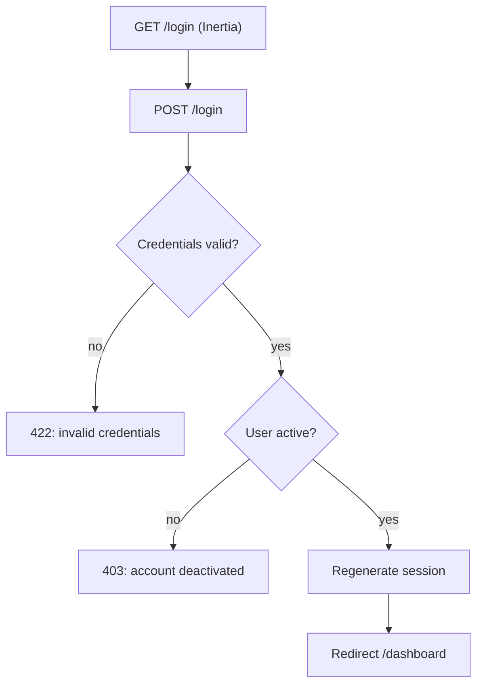

# 03 — Auth

## Purpose

Authenticate clinic staff (4 roles) and gate every Inertia page and API endpoint.

## Database — `users`

```php
// 2026_01_01_000001_create_users_table.php
Schema::create('users', function (Blueprint $table) {
    $table->id();
    $table->string('name');
    $table->string('email')->unique();
    $table->timestamp('email_verified_at')->nullable();   // Breeze handles
    $table->string('password');
    $table->string('role');                                // convenience denorm; Spatie is source of truth
    $table->boolean('is_active')->default(true);
    $table->rememberToken();
    $table->timestamps();
});
```

RBAC tables (Spatie migrations): `roles`, `permissions`, `model_has_roles`, `model_has_permissions`, `role_has_permissions`. Seed 4 roles + full catalogue from `config/permissions.php` (see 14-permissions.md).

## Model

```php
class User extends Authenticatable
{
    use HasRoles, Notifiable;   // spatie/laravel-permission

    protected $fillable = ['name', 'email', 'password', 'is_active'];

    protected $hidden = ['password', 'remember_token'];

    protected function casts(): array
    {
        return [
            'email_verified_at' => 'datetime',
            'password'          => 'hashed',
            'is_active'         => 'boolean',
        ];
    }

    public function isAdmin(): bool { return $this->hasRole(Role::ADMINISTRATOR); }

    public function isDentist(): bool { return $this->hasRole(Role::DENTIST); }
}
```

## Auth Strategy

- **Laravel Breeze** (Inertia + Vue 3 preset) for login/logout/password reset.
- Middleware on all authenticated routes: `auth` + `verified` + `role:administrator|dentist|assistant|receptionist` (any of the four), then policy/permission gates per action.
- Deactivated user (`is_active = false`) blocked via `EnsureUserIsActive` middleware after login (403 with message).

## Login Flow



## Session & Security

- Session driver `database` (tablet stability; single active session per user enforced — older session invalidated on re-login).
- CSRF via Laravel defaults; Inertia CSRF cookie.
- Password policy: min 8 chars (Breeze default) — note in Open Questions Q6 (PH dentists often want weaker; keep default).
- Session lifetime 720 min (day-long clinic sessions), `'expire_on_close' => false` so tablets can sleep/wake without forcing re-login; login persists per device.

## Permissions

| Permission | Roles |
|---|---|
| `users.view` | administrator |
| `users.create` | administrator |
| `users.update` | administrator |
| `users.delete` | administrator |

## UI Elements (improvised)

- `/login` — centered card, large touch inputs, clinic logo.
- `/users` — admin-only table with role select, active toggle.
- Nav bar shows current user + role badge; logout button (≥44px touch).

## Seed Data

```php
// database/seeders/RolePermissionSeeder.php
collect(config('permissions'))->each(fn ($perm) => Permission::firstOrCreate(['name' => $perm]));
Role::create(['name' => 'Administrator'])->givePermissionTo(Permission::all());
Role::create(['name' => 'Dentist'])->givePermissionTo([... /* see 14-permissions.md */]);
Role::create(['name' => 'Assistant'])->givePermissionTo([...]);
Role::create(['name' => 'Receptionist'])->givePermissionTo([...]);
User::factory()->create(['name' => 'Admin', 'email' => 'admin@clinic.test'])->assignRole('Administrator');
```
