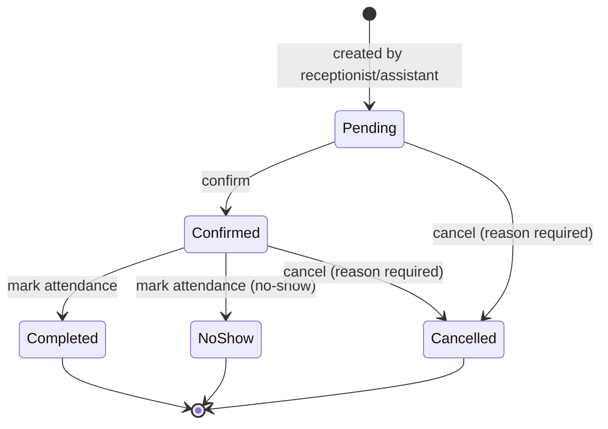

# 05 — Appointments

## Purpose

Schedule, reschedule, cancel, and record attendance for patient visits (spec §7). Managed by Receptionist and Assistant.

## Database — `appointments`

```php
// 2026_01_01_000005_create_appointments_table.php
Schema::create('appointments', function (Blueprint $table) {
    $table->id();
    $table->foreignId('patient_id')->constrained()->cascadeOnDelete();
    $table->foreignId('dentist_id')->nullable()->constrained('users')->nullOnDelete(); // assigned dentist
    $table->date('appointment_date');
    $table->time('start_time');
    $table->time('end_time')->nullable();
    $table->string('reason')->nullable();                    // reason for visit / procedure intent
    $table->string('status')->default('pending');            // AppointmentStatus enum
    $table->text('notes')->nullable();
    $table->timestamp('attended_at')->nullable();            // attendance stamp (Completed / No-show)
    $table->foreignId('created_by')->nullable()->constrained('users')->nullOnDelete();
    $table->timestamps();

    $table->index(['appointment_date', 'status']);
    $table->index('dentist_id');
});
```

## Enum — `AppointmentStatus` (all 5 from spec §7)

```php
enum AppointmentStatus: string
{
    case Pending   = 'pending';
    case Confirmed = 'confirmed';
    case Completed = 'completed';
    case Cancelled = 'cancelled';
    case NoShow    = 'no_show';

    // meta(): label, color token (--color-status-*), icon
}
```

## State Machine



Transitions guarded in `AppointmentService`; invalid transitions throw `InvalidTransitionException` (422). No rescheduling after Completed.

## Service

```php
final class AppointmentService
{
    private const TRANSITIONS = [
        AppointmentStatus::Pending->value   => ['confirmed', 'cancelled'],
        AppointmentStatus::Confirmed->value => ['completed', 'no_show', 'cancelled'],
        AppointmentStatus::Completed->value => [],
        AppointmentStatus::NoShow->value    => [],
        AppointmentStatus::Cancelled->value => [],
    ];

    public function create(array $data, User $actor): Appointment
    public function reschedule(Appointment $a, array $data): Appointment   // date/time change; status back to 'pending'
    public function confirm(Appointment $a, User $actor): Appointment
    public function cancel(Appointment $a, string $reason, User $actor): Appointment
    public function markAttendance(Appointment $a, bool $present, User $actor): Appointment
    // each transition: checkTransition() → update status → activity()->log('appointment.confirmed') etc.
    public function overlaps(Appointment $a, Appointment $b): bool          // same dentist, overlapping time window
}
```

Rule: no overlapping appointments for the same `dentist_id` within the same time window (validation rule `AppointmentTimeWindow` — see Q7).

## Permissions

| Permission | Roles |
|---|---|
| `appointments.view` | administrator, dentist, assistant, receptionist |
| `appointments.create` | administrator, assistant, receptionist |
| `appointments.update` (reschedule) | administrator, assistant, receptionist |
| `appointments.cancel` | administrator, assistant, receptionist |
| `appointments.attendance` | administrator, assistant, receptionist |

## UI Elements (improvised)

- **Day view** (`/appointments`): date navigator (chevrons ≥44px), timeline list of appointments with patient name, time, status chip; tap → detail.
- **Create modal**: patient quick-search, date/time pickers, dentist select, reason.
- **Detail sheet**: status chip, action buttons rendered per state (Confirm / Cancel / Mark attended / Mark no-show / Reschedule), cancel requires reason input.
- **Dashboard widget** (spec §4 *Today's appointments*): same list condensed, tap-through.
