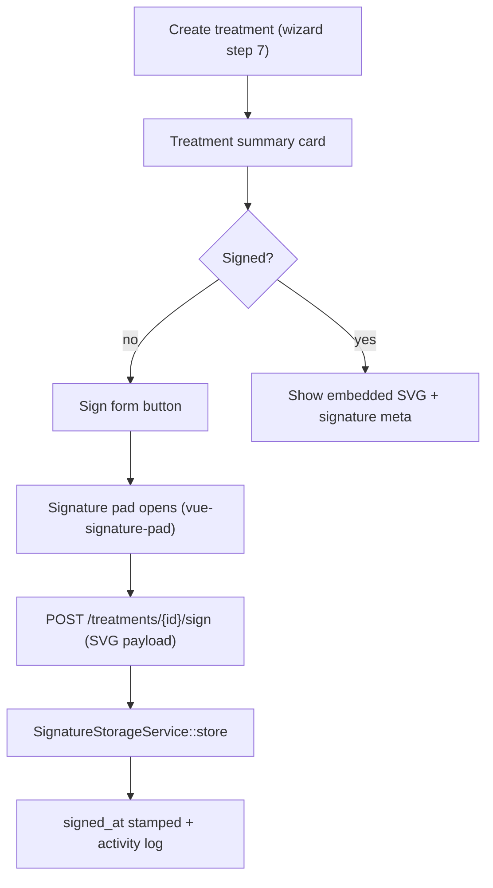

# 08 — Treatment Records

## Purpose

Log procedures performed per patient (spec §10), including the **dentist's electronic signature on treatment forms** (*Sign treatment forms* — dentist role permission). Wizard step 7.

## Database — `treatments`

```php
// 2026_01_01_000008_create_treatments_table.php
Schema::create('treatments', function (Blueprint $table) {
    $table->id();
    $table->foreignId('patient_id')->constrained()->cascadeOnDelete();
    $table->foreignId('consultation_id')->nullable()->constrained()->nullOnDelete(); // optional link
    $table->unsignedTinyInteger('tooth_number')->nullable();  // FDI; null = non-tooth procedure
    $table->string('procedure_name');
    $table->text('description')->nullable();
    $table->text('notes')->nullable();
    $table->foreignId('dentist_id')->constrained('users')->cascadeOnDelete();
    $table->date('treatment_date');
    // electronic signature — dentist signs the treatment form on tablet
    $table->string('signature_path')->nullable();             // SVG file path (see SignatureStorageService)
    $table->timestamp('signed_at')->nullable();
    $table->timestamps();

    $table->index(['patient_id', 'treatment_date']);
});
```

> No `fee` column — billing explicitly out of scope (Q8).

## Model

```php
class Treatment extends Model
{
    use HasActivity;

    protected $guarded = [];

    protected function casts(): array
    {
        return ['treatment_date' => 'date', 'signed_at' => 'datetime'];
    }

    public function patient(): BelongsTo { ... }
    public function consultation(): BelongsTo { ... }
    public function dentist(): BelongsTo { return $this->belongsTo(User::class, 'dentist_id'); }

    public function isSigned(): bool { return $this->signed_at !== null; }
}
```

## Service

```php
final class TreatmentService
{
    /** Create treatment + optional auto-sign */
    public function create(array $data, User $dentist): Treatment

    /** Dentist signs the treatment form; captures signature SVG, stamps signed_at */
    public function sign(Treatment $treatment, string $signatureSvg, User $dentist): Treatment
    {
        // Guards: only authoring dentist or admin (TreatmentPolicy::sign)
        $path = SignatureStorageService::store($signatureSvg, "signatures/treatments/{$treatment->id}.svg");
        $treatment->update(['signature_path' => $path, 'signed_at' => now()]);
        activity()->performedOn($treatment)->causedBy($dentist)->log('treatment.signed');
        return $treatment;
    }
}
```

## Signing Flow



## Permissions

| Permission | Roles |
|---|---|
| `treatments.view` | administrator, dentist |
| `treatments.create` | administrator, dentist |
| `treatments.update` | administrator, dentist |
| `treatments.sign` | administrator, dentist |

## UI Elements (improvised)

- **Treatment form**: procedure select (free text with datalist of common procedures), tooth number input (numeric keypad-friendly), description/notes textareas, date picker.
- **Signature pad**: full-screen overlay on tablet, canvas 300×150+, "Clear" + "Accept signature" buttons (≥44px), stores SVG.
- **Treatment list** on patient record: signed badge (✓ signature icon) vs pending; tap → detail with embedded signature image.
