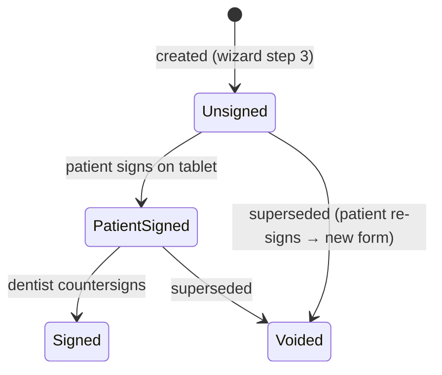

# 10 — Waiver & Informed Consent

## Purpose

Capture the patient's digital signature on the PDA-informed-consent waiver directly on the tablet (spec §12, §14). Wizard step 3 (before consultation — patient-facing).

## Database — `consent_forms`

```php
// 2026_01_01_000010_create_consent_forms_table.php
Schema::create('consent_forms', function (Blueprint $table) {
    $table->id();
    $table->foreignId('patient_id')->constrained()->cascadeOnDelete();
    $table->string('version', 10)->default('1.0');            // template version
    $table->text('consent_text');                             // SNAPSHOT of the waiver wording at signing time
    $table->string('patient_name');                           // captured, not derived — printed on form
    $table->string('patient_signature_path');
    $table->string('guardian_name')->nullable();              // required if minor (Q4)
    $table->string('guardian_signature_path')->nullable();
    $table->foreignId('dentist_id')->constrained('users')->cascadeOnDelete();
    $table->string('dentist_signature_path')->nullable();     // dentist countersigns (spec §12 signature section)
    $table->timestamp('patient_signed_at')->nullable();
    $table->timestamp('dentist_signed_at')->nullable();
    $table->string('ip_address')->nullable();                 // device audit
    $table->string('user_agent')->nullable();
    $table->string('status')->default('unsigned');            // ConsentStatus enum
    $table->timestamps();

    $table->index(['patient_id', 'status']);
});
```

## Enum — `ConsentStatus`

```php
enum ConsentStatus: string
{
    case Unsigned      = 'unsigned';
    case PatientSigned = 'patient_signed';
    case Signed        = 'signed';       // both patient + dentist
    case Voided        = 'voided';       // replaced by a newer consent (re-sign)
    // meta(): label, color token
}
```

## State Machine



## Service

```php
final class ConsentService
{
    public function createDraft(Patient $patient, User $dentist): ConsentForm
    {
        // Snapshot current template: ConsentTemplate::current() → ['version' => '1.0', 'text' => '...']
        return ConsentForm::create([...]);
    }

    public function signPatient(ConsentForm $form, string $signatureSvg, ?string $guardianName, ?string $guardianSvg): ConsentForm
    {
        // Guard: patient must be present; guardian required when patient.age < 18 (Q4)
        $form->update([
            'patient_signature_path' => SignatureStorageService::store($svg, "signatures/consents/{$form->id}-patient.svg"),
            'guardian_name'          => $guardianName,
            'guardian_signature_path'=> $guardianSvg ? store(...) : null,
            'patient_signed_at'      => now(),
            'status'                 => ConsentStatus::PatientSigned->value,
            'ip_address'             => request()->ip(),
            'user_agent'             => request()->userAgent(),
        ]);
        activity()->performedOn($form)->log('consent.patient_signed');
        return $form;
    }

    public function signDentist(ConsentForm $form, string $signatureSvg, User $dentist): ConsentForm { ... }
    // → status = Signed, dentist_signed_at stamped

    public function voidAndRecreate(ConsentForm $form, User $actor): ConsentForm
    // void old → createDraft(new) — chained when patient re-signs
}
```

## Signature Capture (spec §14)

- Library: `szimek/signature_pad` via `vue-signature-pad` (Vue 3 wrapper).
- Export as **SVG data URL** (`toDataURL('image/svg+xml')`) → sent as JSON to server → `SignatureStorageService` writes vector SVG to `storage/app/signatures/`.
- Vector SVG chosen over PNG: tiny size, infinitely zoomable for legal/print reproduction, no pixelation when printed on A4.
- Pad spec: ≥300×150 logical px canvas, ink color `oklch(0.18 0 0)` (near-black), smoothing enabled, "Clear" + "Accept" buttons ≥44px.

## Consent Template (spec §12 text, verbatim)

Stored as a **config/template** (`ConsentTemplate` model or `config/consent.php`) — the §12 paragraphs:

> I voluntarily authorize the attending dentist to perform the procedures that have been explained to me.
> I understand that dentistry is not an exact science and that no guarantee has been made regarding the outcome of treatment.
> I acknowledge that unforeseen conditions may require additional procedures.
> I understand the risks associated with dental treatment, including discomfort, bleeding, infection, allergic reactions, swelling, and the possibility of complications.
> I consent to the collection, storage, and processing of my personal information for medical, administrative, and legal purposes.
> I certify that the information I have provided is complete and accurate.

Signature section (printed on the signed form): **Patient name / Patient signature / Parent-guardian / Dentist / Date** (spec §12 block).

## Permissions

| Permission | Roles |
|---|---|
| `consents.view` | administrator, dentist, assistant |
| `consents.create` | administrator, dentist, assistant |
| `consents.sign-patient` | administrator, dentist, assistant (device held by staff; patient draws) |
| `consents.sign-dentist` | administrator, dentist |

## UI Elements (improvised — patient-facing step)

- **Waiver screen** (wizard step 3): scrollable consent text (≥16px, high contrast), checkbox "I have read and understood", then signature canvas.
- **Patient signs first** → guardian signature appears if patient < 18 (guardian name field pre-filled from patient contact).
- **Dentist countersign** step runs at consultation end (step 5→6 boundary) or treatment time.
- Signed form → rendered as printable A4 layout (SVG signatures embedded) → PDF export via browser print.
