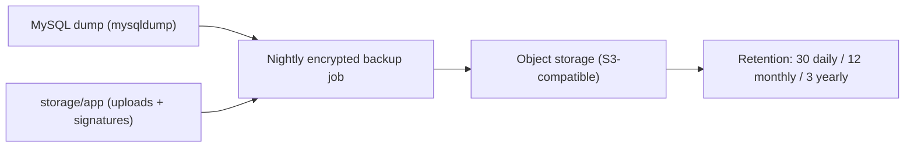

# 12 — Cross-Cutting Concerns

## Tenancy & Portals

- **Single tenant, single clinic** — no `branch_id`, no tenant middleware. Decision tree: no branches → simple CRUD.
- **Single portal** (clinic staff web app). No patient/mobile portal. Tablet is just a web browser client of the same app; responsive layout handles it. No separate guard middleware needed (unlike the multi-portal pattern).

## Audit Trail

`spatie/laravel-activitylog` on clinical + administrative entities:

| Entity | Logged events |
|---|---|
| Patient | registered, updated, deleted (soft) |
| Appointment | created, confirmed, cancelled, rescheduled, attended, no_show |
| Consultation | created, updated |
| DentalChartEntry | updated (each immutable insert) |
| Treatment | created, signed |
| Attachment | uploaded, deleted |
| ConsentForm | patient_signed, dentist_signed, voided |
| User | created, role_changed, deactivated |

Audit rows: `causer_id`, `subject_type/id`, `event`, `properties` (diff of changes), `ip_address`, `created_at`. Retention: indefinite (medico-legal); part of Phase 4 archival.

## File Storage

- Default disk `local`: `storage/app/uploads/{patient_id}/`, `storage/app/signatures/`.
- Production option: `s3` disk (X-rays/PDFs) — Q14. Storage config abstracted behind `AttachmentService`/`SignatureStorageService` so swap is one env change.
- Both disks behind **backup pipeline** (below).

## Backup & Archiving (spec §16 Phase 4)

- `laravel-backup` package (Spatie) on schedule: `database` + `local` disk → S3.
- **Archiving**: patients `deleted_at` after N years inactivity (configurable, default 5, Q15); archive job exports soft-deleted patient full record (chart, consents, attachments) to immutable archive bucket then hard-deletes.
- Restore drill: monthly (documented in runbook).

## Caching & Queues

- Cache: `settings` keys (60s), patient search hot lists (5 min), dashboard widget queries (2 min).
- Queues: `database` driver; jobs — backup, archive, report exports (sync in v1 is acceptable; queue when report volume grows).
- Horizon unnecessary at this scale (single clinic).

## Sessions & Tablet Behavior

- Session driver `database`; long-lived (720 min), `expire_on_close=false` — tablets sleep/wake without re-auth.
- Tablets share the staff account (session per user is fine; only one device per user assumption — Q16).
- PWA/offline: **out of scope v1** (clinic Wi-Fi assumed). Open question Q17.

## Error Handling

- 419 (CSRF expiry on sleeping tablet) → auto-refresh to login page with preserved Inertia props; toast "Session expired".
- 500 page: friendly tablet-sized error with incident id (log context).
- Validation errors: Inertia `$errors` inline under fields, red highlight, scroll-to-first-error.

## API Surface Summary (endpoints with JSON responses)

| Endpoint | Purpose | Auth |
|---|---|---|
| `POST /api/signatures` | store signature SVG → path | auth + policy |
| `POST /treatments/{id}/sign` | sign treatment form | `treatments.sign` |
| `POST /consents/{id}/patient-sign` | patient + guardian sign | `consents.sign-patient` |
| `POST /consents/{id}/dentist-sign` | dentist countersign | `consents.sign-dentist` |
| `POST /attachments` | chunked upload with progress | `attachments.upload` |
| `POST /dental-chart/entries` | immutable chart entry | `dental-chart.update` |
| `GET /patients/{id}/chart?as_of=date` | historical chart state | `dental-chart.view` |
| `GET /reports/*` | report data (Inertia page) | `reports.view` |

Everything else is Inertia page navigation (page + data in one response).
