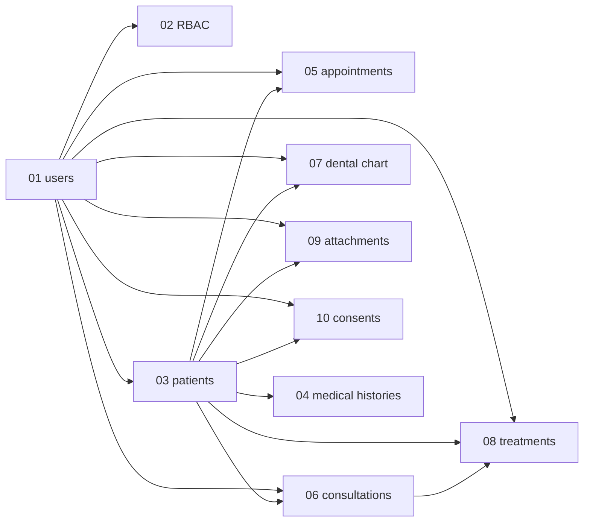

# 15 — Migration Order

Numbered, dependency-ordered. All anonymous-class migrations; no MySQL `enum()`.

| # | Migration | Depends on | Notes |
|---|---|---|---|
| 01 | `create_users_table` | — | auth base |
| 02 | Spatie RBAC migrations (published) | 01 | `roles`, `permissions`, `model_has_roles`, `model_has_permissions`, `role_has_permissions` |
| 03 | `create_patients_table` | 01 | FK `created_by` → users; soft deletes |
| 04 | `create_medical_histories_table` | 03 | FK `patient_id` unique; FK `recorded_by` → users |
| 05 | `create_appointments_table` | 03, 01 | FKs `patient_id`, `dentist_id`, `created_by` |
| 06 | `create_consultations_table` | 03, 01 | FKs `patient_id`, `dentist_id` |
| 07 | `create_dental_chart_entries_table` | 03, 01 | FKs `patient_id`, `recorded_by`; immutable log |
| 08 | `create_treatments_table` | 03, 06, 01 | FKs `patient_id`, `consultation_id` nullable, `dentist_id` |
| 09 | `create_attachments_table` | 03, 01 | FKs `patient_id`, `uploaded_by` |
| 10 | `create_consent_forms_table` | 03, 01 | FKs `patient_id`, `dentist_id`; text snapshots + signature paths |
| 11 | `create_settings_table` | — | key-value, unique `key` |
| 12 | `create_activity_log_table` | — | spatie/laravel-activitylog published migration |

## Dependency Graph

## Seed Order

1. `RolePermissionSeeder` — 35 permissions + 4 roles (must run before any user creation).
2. `SettingsSeeder` — clinic.name, consent.version=1.0, etc.
3. `AdminUserSeeder` — default admin (`admin@clinic.test`).
