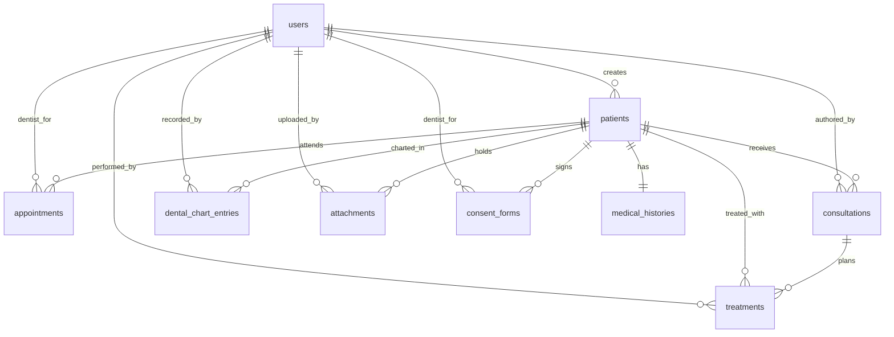
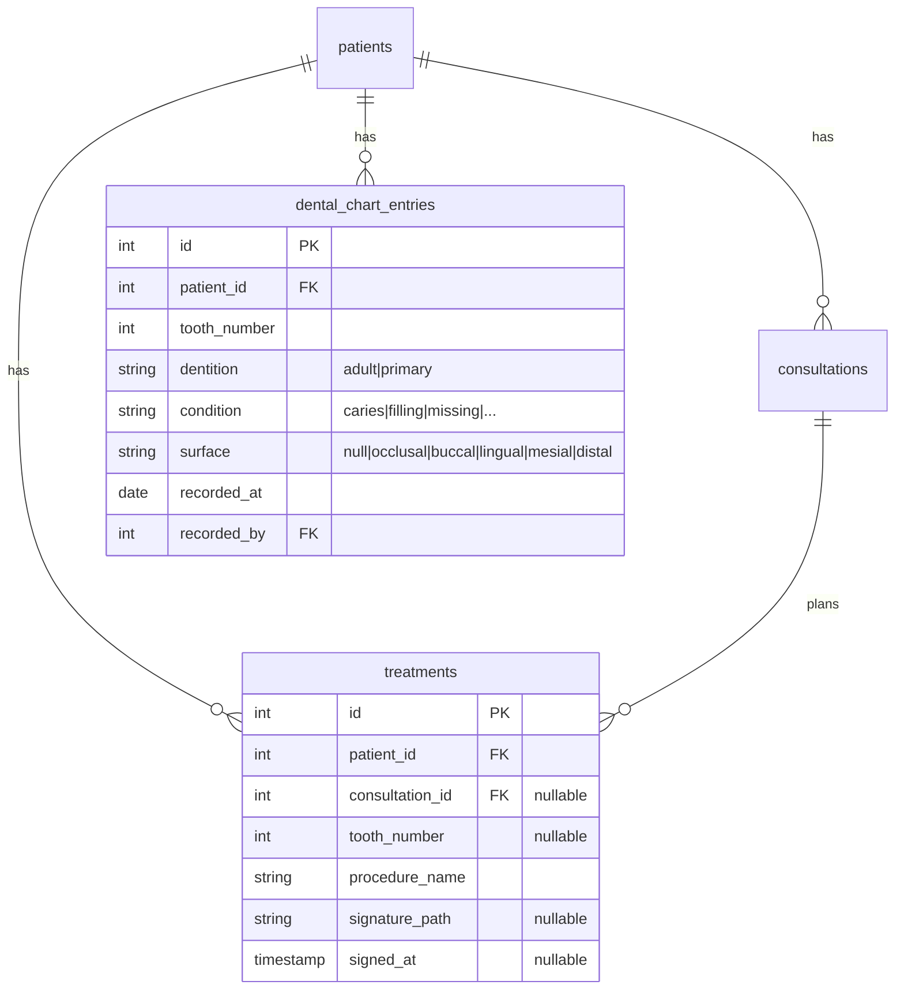
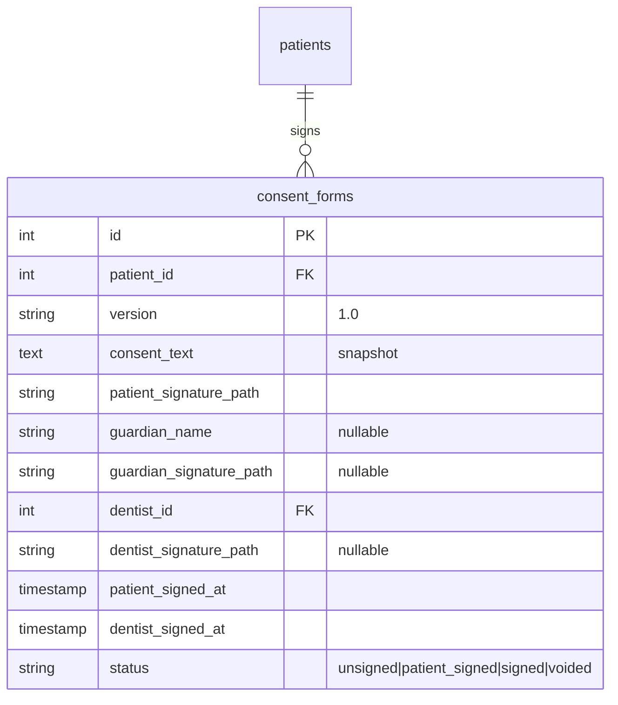
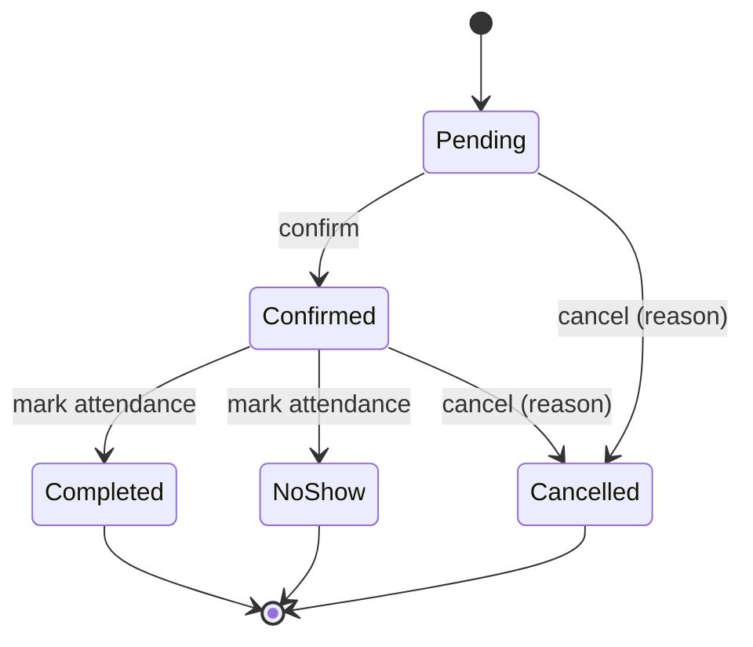
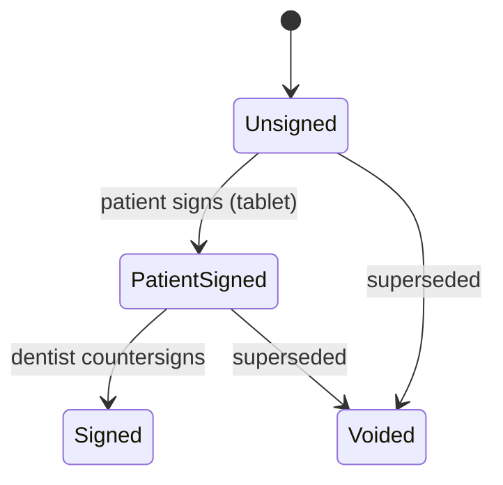
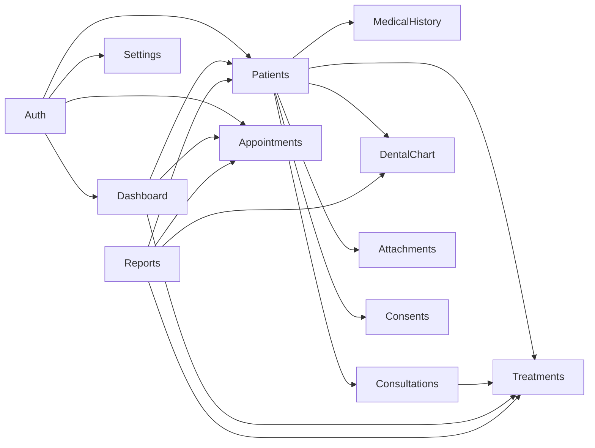
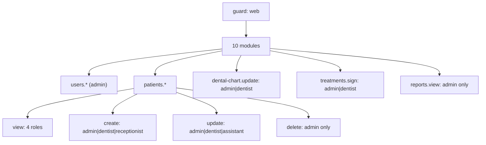

# 16 — ERD & State Machines

## Master ERD

## Domain Island: Clinical Core

## Domain Island: Consents (legal chain)

## State Machine: Appointment (spec §7 statuses)

## State Machine: Consent

## Module Dependency

## Permission Hierarchy

