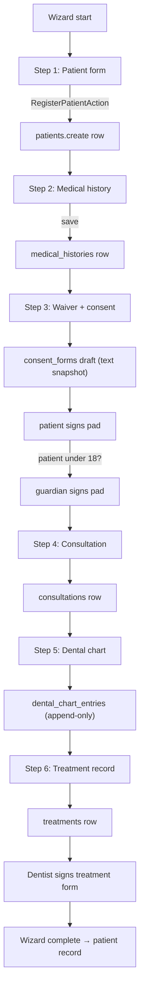
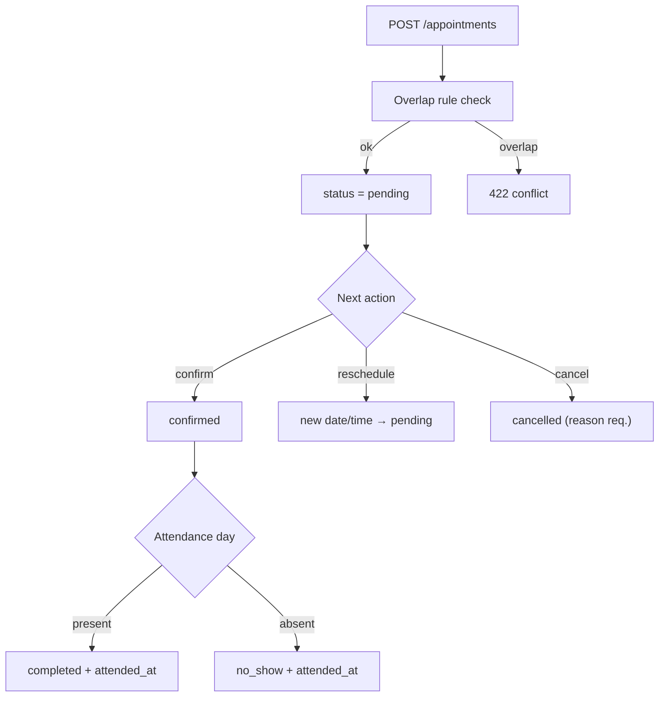
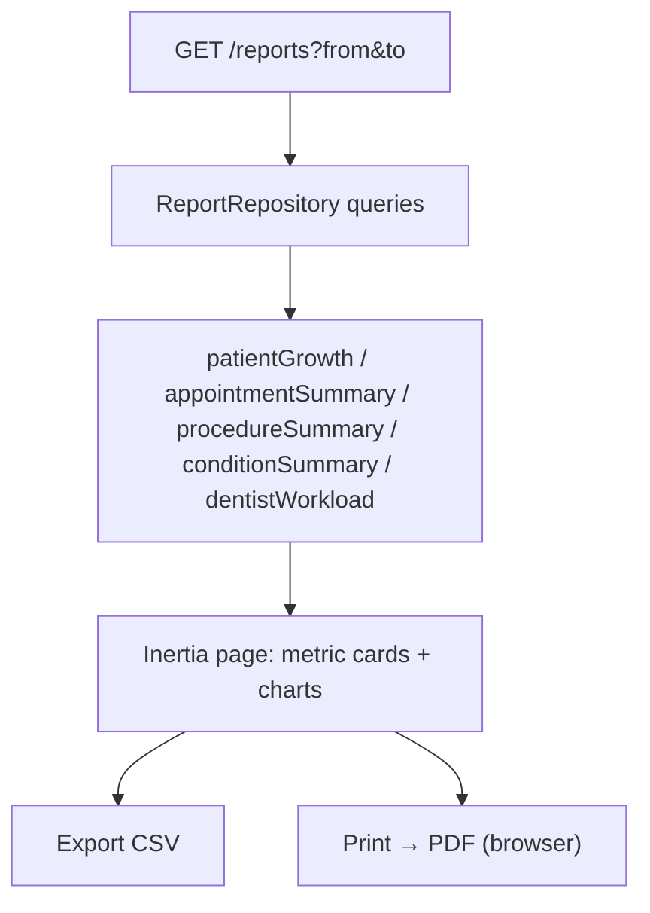
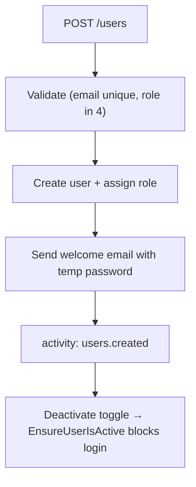

# 17 — Process Flows

All flows as code skeletons. Wizard flow is the core tablet experience (spec tail section).

## Flow 1 — Patient Intake Wizard (tablet, spec-ordered)



```php
// routes/web.php
Route::prefix('wizard')->group(function () {
    Route::get('/{patient?}', [WizardController::class, 'index'])->name('wizard.index');
    Route::post('/patients', [WizardController::class, 'patient'])->name('wizard.patient');       // step 1
    Route::post('/medical-histories', [WizardController::class, 'medicalHistory']);               // step 2
    Route::post('/consents', [WizardController::class, 'consent']);                                // step 3
    Route::post('/consultations', [WizardController::class, 'consultation']);                     // step 4
    Route::post('/dental-chart', [WizardController::class, 'dentalChart']);                       // step 5
    Route::post('/treatments', [WizardController::class, 'treatment']);                           // step 6
});
```

Each step POSTs its own entity and returns `{ next_step, entity_id }` — steps are **independently persisted**, so a tablet crash loses at most the current step; resume re-enters at the last completed step (Pinia stores `wizard.progress`).

## Flow 2 — Appointment Lifecycle



```php
final class AppointmentService
{
    public function create(array $data, User $actor): Appointment
    {
        abort_unless($actor->can('appointments.create'), 403);
        $this->ensureNoOverlap($data);                       // 422 on conflict
        return $this->transition($appointment = Appointment::create($data), 'created', $actor);
    }

    private function transition(Appointment $a, string $event, User $actor): Appointment
    {
        throw_unless(in_array($event, self::TRANSITIONS[$a->status->value], true),
            InvalidTransitionException::class);              // 422
        $a->update([...]);                                   // status, attended_at...
        activity()->performedOn($a)->causedBy($actor)->log("appointment.{$event}");
        return $a;
    }
}
```

## Flow 3 — Consent Signing (legal, spec §12)

```php
final class ConsentService
{
    public function signPatient(ConsentForm $form, string $svg, ?string $guardianName, ?string $guardianSvg): ConsentForm
    {
        abort_unless(request()->user()->can('consents.sign-patient'), 403);
        abort_unless($form->status === ConsentStatus::Unsigned, 409);
        if ($form->patient->age < 18) {                       // Q4
            abort_unless($guardianName && $guardianSvg, 422, 'Guardian signature required for minors.');
        }
        // 1. validate+store SVG(s) → SignatureStorageService
        // 2. stamp patient_signed_at, capture ip_address + user_agent
        // 3. status = patient_signed, activity()->log('consent.patient_signed')
        return $form->refresh();
    }
}
```

## Flow 4 — Dental Chart Update

```php
final class RecordToothConditionAction
{
    public function handle(Patient $p, int $tooth, DentitionType $dentition, ToothCondition $condition,
                           ?ToothSurface $surface, Carbon $recordedAt, User $dentist): DentalChartEntry
    {
        abort_unless($dentist->can('dental-chart.update'), 403);
        abort_unless($this->validFdiRange($tooth, $dentition), 422, "Tooth {$tooth} invalid for {$dentition->value} dentition.");
        $entry = DentalChartEntry::create([...]);             // immutable insert
        activity()->performedOn($entry)->causedBy($dentist)->log('chart.updated');
        return $entry;                                        // response includes new currentState projection
    }
}
```

## Flow 5 — Report Generation (admin, monthly statistics)



## Flow 6 — User Management (admin)



```php
final class CreateUserAction
{
    public function handle(array $data, User $actor): User
    {
        abort_unless($actor->can('users.create'), 403);
        return DB::transaction(function () use ($data) {
            $user = User::create(['password' => Str::password(10), ...$data]);
            $user->assignRole($data['role']);
            Mail::to($user)->queue(new WelcomeMail($user, $temporaryPassword));
            activity()->performedOn($user)->causedBy($actor)->log('users.created');
            return $user;
        });
    }
}
```
