# DCPRS — Master Blueprint (concatenated)


---

# DCPRS — Backend Architecture Blueprint

**Dental Clinic Patient Record System (DCPRS)** — internal EMR replacing the paper-based PDA dental chart. Tablet-first web application.

**Stack:** Laravel 12 · Vue 3 · Inertia.js · Tailwind CSS v4 · MySQL 8

---

## Quick Nav

| File | Contents |
|---|---|
| [01-overview.md](01-overview.md) | Executive summary, module map, roles, key decisions |
| [02-tech-stack.md](02-tech-stack.md) | Stack, conventions, improvised design tokens, tablet-first rules |
| [03-auth.md](03-auth.md) | Users, login, RBAC seeding, session/security |
| [04-patients.md](04-patients.md) | Patients + Medical History |
| [05-appointments.md](05-appointments.md) | Appointments (schedule, reschedule, cancel, attendance) |
| [06-consultations.md](06-consultations.md) | Consultations |
| [07-dental-chart.md](07-dental-chart.md) | Dental chart (FDI numbering, surfaces, conditions, color coding) |
| [08-treatments.md](08-treatments.md) | Treatment records + dentist e-signature |
| [09-attachments.md](09-attachments.md) | File attachments (X-rays, prescriptions, lab results) |
| [10-consents.md](10-consents.md) | Waiver & informed consent with signature capture |
| [11-dashboard-reports-settings.md](11-dashboard-reports-settings.md) | Dashboard widgets, reports, settings |
| [12-cross-cutting.md](12-cross-cutting.md) | Audit trail, storage, backup/archiving, tablet considerations |
| [13-api-contracts.md](13-api-contracts.md) | Routes, request/response formats, errors, rate limits |
| [14-permissions.md](14-permissions.md) | Installable `config/permissions.php` + role matrix |
| [15-migration-order.md](15-migration-order.md) | 12 migrations in dependency order |
| [16-erd.md](16-erd.md) | Mermaid ERDs, state machines, dependency graph |
| [17-process-flows.md](17-process-flows.md) | 6 process flows as code skeletons |
| [18-open-questions.md](18-open-questions.md) | Assumptions, risks, validation questions |
| [99-master.md](99-master.md) | Full concatenated document |

## Key Numbers

- **10 modules** (auth, patients, medical history, appointments, consultations, dental chart, treatments, attachments, consents, dashboard/reports/settings)
- **12 database tables** + 4 Spatie RBAC tables
- **4 roles**: Administrator, Dentist, Assistant, Receptionist
- **35 permissions**
- **8 enums** (3 clinical: dentition, tooth condition, tooth surface; 5 operational: sex, civil status, appointment status, attachment category, consent status)
- **2 state machines**: appointment (5 states), consent (3 states)
- **6 process flows**

## Reviewer Checklist

- [ ] Every idea.md module has a table + permissions
- [ ] All 17 patient fields from spec §5 present in `patients`
- [ ] All 10 medical history questions from spec §6 present
- [ ] All 5 appointment statuses from spec §7 present
- [ ] All 5 tooth surfaces + 8 tooth conditions from spec §9 present
- [ ] Treatment "sign" flow (spec: *Sign treatment forms*) implemented
- [ ] Consent form text from spec §12 snapshot-able
- [ ] No MySQL `enum()` — all status columns are `string` + PHP BackedEnum
- [ ] Every API endpoint has a permission
- [ ] Every inference flagged in 18-open-questions.md

---

# 01 — Overview

## Executive Summary

DCPRS is an internal electronic medical record (EMR) platform that replaces the paper-based Philippine Dental Association (PDA) dental chart. It runs on **tablets (≥10″) and desktop browsers** (Chrome, Safari, Edge) inside the clinic, and is used by dentists, assistants, and receptionists to manage patient information, appointments, treatment records, dental charts, attachments, and informed consent forms.

This is a **single-clinic, single-tenant** system. No branches, no billing/payments, no patient portal — the clinic staff are the only users; patients only interact with the device through the signature pad during consent.

## Module Map

| # | Module | Source (§) | Tables | Primary Roles |
|---|---|---|---|---|
| 1 | Auth | Phase 1 | `users`, RBAC | Admin |
| 2 | Patients | §5 | `patients` | Receptionist (register), Dentist, Assistant |
| 3 | Medical History | §6 | `medical_histories` | Dentist |
| 4 | Appointments | §7 | `appointments` | Receptionist, Assistant |
| 5 | Consultations | §8 | `consultations` | Dentist |
| 6 | Dental Chart | §9 | `dental_chart_entries` | Dentist |
| 7 | Treatments | §10 | `treatments` | Dentist |
| 8 | Attachments | §11 | `attachments` | Assistant, Dentist |
| 9 | Waiver & Consent | §12, §14 | `consent_forms` | Dentist, Assistant (patient signs) |
| 10 | Dashboard / Reports / Settings | §4, §3 | `settings` | Admin (reports), All (dashboard) |

## Roles and Scope

| Role | Scope |
|---|---|
| **Administrator** | Create users, manage settings, view reports, manage records (full CRUD incl. delete) |
| **Dentist** | Create patient records, create consultations, update dental charts, create treatment records, sign treatment forms + consent forms |
| **Assistant** | Upload attachments, manage appointments, update patient records |
| **Receptionist** | Register patients, schedule appointments, search patient records |

## Key Architectural Decisions

1. **Single tenant, single clinic** — no `branch_id` scoping anywhere.
2. **Wizard-style intake flow** on tablet: Patient → Medical history → Waiver → Signature → Consultation → Dental chart → Treatment record. Each step persists independently so a tablet crash never loses prior steps.
3. **Append-only dental chart log** — every chart edit inserts a new `dental_chart_entries` row (immutable, timestamped, user-attributed). The rendered chart is the latest state per tooth/surface; history is filterable by date. This satisfies the *historical records* requirement with a full audit trail.
4. **Electronic signatures stored as vector SVG** (small, zoomable, legally reproducible) via `szimek/signature_pad` (`vue-signature-pad` wrapper for Vue 3).
5. **Consent text snapshotted** per form — the exact waiver wording is copied into the row at signing time so later template edits never invalidate signed forms.
6. **No billing** — fees/payments are explicitly out of scope (see Open Questions).
7. **RBAC via Spatie Laravel Permission** with an installable `config/permissions.php` catalogue; role seeding matches the four roles above.
8. **Reports are admin-only** per spec §3 (*Administrator — View reports*). Other roles read dashboards only.
9. **Online-only** — no offline sync. Open question with default "out of scope v1".
10. **No patient-facing portal** — patients never get accounts; they only sign the tablet.

## Development Phases (from spec §16, unchanged)

| Phase | Scope |
|---|---|
| 1 | Authentication, patient registration, appointments |
| 2 | Dental chart, consultations, treatments |
| 3 | Electronic signatures, file uploads, reports |
| 4 | Backup and archiving |

## System Boundary

- **In:** patient data, medical history, appointments, consultations, dental chart, treatments, attachments, e-signatures, consent, reports, settings, users.
- **Out (v1):** payments/billing, insurance, SMS/email reminders, patient portal, lab integration, offline mode, multi-branch.

## Glossary

| Term | Meaning |
|---|---|
| EMR | Electronic Medical Record |
| PDA | Philippine Dental Association |
| FDI | FDI World Dental Federation tooth numbering (ISO 3950) |
| Dentition | Adult (permanent) vs Primary (deciduous/baby teeth) |
| Pontic | Artificial tooth on a bridge replacing a missing tooth |
| Attended / No-show | Appointment attendance outcomes recorded by receptionist |

---

# 02 — Tech Stack & Conventions

## Stack

| Layer | Choice | Version/Notes |
|---|---|---|
| Backend | Laravel | 12 (PHP 8.3) |
| Frontend | Vue 3 `<script setup>` Composition API | via Inertia.js v2 |
| Full-stack glue | Inertia.js | `laravel-vite-plugin` + `@inertiajs/vue3` |
| Styling | Tailwind CSS v4 | CSS-first config, design tokens in `@theme` (OKLCH) |
| Database | MySQL 8 | InnoDB, utf8mb4 |
| Build | Vite | |
| Signatures | `szimek/signature_pad` + `vue-signature-pad` | SVG export |
| RBAC | `spatie/laravel-permission` | |
| Auditing | `spatie/laravel-activitylog` | |
| Routes in JS | `ziggy` | |
| Dev | laravel-debugbar, Pint, PHPStan | |

## Conventions (no boilerplate exists — these are the proposed project conventions)

### Migrations
- **Anonymous class migrations** (`return new class extends Migration`).
- Naming: `create_{table}_table`, `add_{column}_to_{table}_table`.
- **No MySQL `enum()`** — all status/type columns are `string` + PHP `BackedEnum` with a `meta()` method.
- Foreign keys: `foreignId()->constrained()->cascadeOnDelete()` except where business rules require nullability (e.g., `dentist_id` nullable with `nullOnDelete()`).
- `patients` uses **soft deletes** (Phase 4 archiving); clinical data (chart entries, treatments, consents) is **append-only and never hard-deleted** — destroy is restricted to Administrator via policy.
- Timestamps on every table.

### Directory layout (from spec §15)
```
app/
├── Actions          # single-purpose workflows (e.g., RegisterPatient, SignConsent)
├── Enums            # BackedEnums with meta() (labels, colors, icons)
├── Http/Controllers # thin, Inertia pages only; no business logic
├── Models           # Eloquent, guarded: []
├── Policies         # one per guarded entity
├── Services         # multi-step business logic (state transitions, chart logic)
└── Repositories     # query/read models (search, report queries)

resources/js/
├── Components       # shared (SignaturePad, ToothChart, WizardStep...)
├── Layouts          # AppLayout (sidebar/tablet nav)
├── Pages            # one folder per module
└── Stores            # Pinia (session, chart draft state)
```

### Models
- `protected $guarded = []`; `casts()` for all enums (PHP 8.3 native enum casts).
- Trait `HasActivity` (wraps activitylog) on Patient, Appointment, Treatment, ConsentForm.
- `HasCreatedBy` trait → `created_by` user attribution.
- Scopes: `latestOf()`, `search()` on Patient.

### Services vs Actions vs Repositories
| Type | Used when | Examples |
|---|---|---|
| `Action` | Single write intent, few steps | `RegisterPatient`, `SignConsent`, `RescheduleAppointment` |
| `Service` | Multi-step business logic / state machines | `AppointmentService` (status transitions), `DentalChartService` (latest-state projection), `SignatureStorageService` |
| `Repository` | Complex reads | `ReportRepository` (monthly stats), `PatientRepository` (search) |

### Authorization
- Spatie `roles` + `permissions`; permission names `{module}.{action}` (e.g., `patients.create`).
- `Gate` preCheck via `HasRole` middleware on Inertia routes; per-action checks in Policies.
- Admin gets all permissions; catalogue is the single source of truth (`config/permissions.php`).

## Design Tokens (IMPROVISED — no Figma provided)

> All colors are **OKLCH** per project FE rules. These are placeholder tokens until a Figma design exists; see Open Questions Q10.

### Brand & UI (proposed, dental-teal)
```css
@theme {
  --color-brand-50:  oklch(0.97 0.02 200);
  --color-brand-100: oklch(0.93 0.04 200);
  --color-brand-200: oklch(0.87 0.06 200);
  --color-brand-300: oklch(0.79 0.08 200);
  --color-brand-400: oklch(0.70 0.09 200);
  --color-brand-500: oklch(0.60 0.10 200);   /* primary */
  --color-brand-600: oklch(0.53 0.09 200);
  --color-brand-700: oklch(0.45 0.08 200);
  --color-brand-800: oklch(0.37 0.06 200);
  --color-brand-900: oklch(0.30 0.05 200);
}
```

### Tooth condition color coding (spec §9 — *Color coding*)
Map `ToothCondition` → token. Used by `ToothLegend` component and chart renderer.

| Condition | Token | OKLCH | Visual intent |
|---|---|---|---|
| Caries | `--color-cond-caries` | `oklch(0.64 0.24 25)` | red — active decay |
| Filling | `--color-cond-filling` | `oklch(0.55 0.25 263)` | blue — restoration |
| Missing | `--color-cond-missing` | `oklch(0.45 0.01 280)` | neutral — absent tooth (gray-out) |
| Root canal | `--color-cond-root-canal` | `oklch(0.55 0.25 263)` | blue center dot (drawn inside tooth) |
| Crown | `--color-cond-crown` | `oklch(0.54 0.28 293)` | violet outline |
| Fracture | `--color-cond-fracture` | `oklch(0.65 0.22 41)` | orange zigzag line |
| Impacted | `--color-cond-impacted` | `oklch(0.71 0.16 85)` | amber — un-erupted |
| Pontic | `--color-cond-pontic` | `oklch(0.55 0.16 190)` | teal — bridge tooth |

### Semantic
`--color-status-pending` amber · `--color-status-confirmed` blue · `--color-status-completed` green · `--color-status-cancelled` zinc · `--color-status-no-show` red. (Appointment states, spec §7.)

## Tablet-First UI Rules (spec §13 — improvised from spec intent)

1. Minimum screen size **10″**; browsers Chrome, Safari, Edge.
2. **Wizard-style flow** (§spec tail): Patient → Medical history → Waiver → Signature → Consultation → Dental chart → Treatment record — stepper header with back/next, each step saves independently.
3. Touch targets ≥ **44×44 px**; no hover-dependent actions.
4. Large type (min 16px body); signature canvas at ≥ 300×150 logical px.
5. Responsive grid: tablets portrait-first; desktop gets sidebar layout.
6. Progress persistence: wizard step state stored in Pinia; step entities saved server-side per step so refresh/resume is safe.

## Package Dependencies (composer + npm)

```jsonc
// composer.json (proposed additions)
"spatie/laravel-permission": "^6",
"spatie/laravel-activitylog": "^4",
"inertiajs/inertia-laravel": "^2",
"tightenco/ziggy": "^2"

// package.json (proposed additions)
"@inertiajs/vue3": "^2",
"vue-signature-pad": "^3",      // wraps szimek/signature_pad
"ziggy-js": "^2",
"pinia": "^3"
```

---

# 03 — Auth

## Purpose

Authenticate clinic staff (4 roles) and gate every Inertia page and API endpoint.

## Database — `users`

```php
// 2026_01_01_000001_create_users_table.php
Schema::create('users', function (Blueprint $table) {
    $table->id();
    $table->string('name');
    $table->string('email')->unique();
    $table->timestamp('email_verified_at')->nullable();   // Breeze handles
    $table->string('password');
    $table->string('role');                                // convenience denorm; Spatie is source of truth
    $table->boolean('is_active')->default(true);
    $table->rememberToken();
    $table->timestamps();
});
```

RBAC tables (Spatie migrations): `roles`, `permissions`, `model_has_roles`, `model_has_permissions`, `role_has_permissions`. Seed 4 roles + full catalogue from `config/permissions.php` (see 14-permissions.md).

## Model

```php
class User extends Authenticatable
{
    use HasRoles, Notifiable;   // spatie/laravel-permission

    protected $fillable = ['name', 'email', 'password', 'is_active'];

    protected $hidden = ['password', 'remember_token'];

    protected function casts(): array
    {
        return [
            'email_verified_at' => 'datetime',
            'password'          => 'hashed',
            'is_active'         => 'boolean',
        ];
    }

    public function isAdmin(): bool { return $this->hasRole(Role::ADMINISTRATOR); }

    public function isDentist(): bool { return $this->hasRole(Role::DENTIST); }
}
```

## Auth Strategy

- **Laravel Breeze** (Inertia + Vue 3 preset) for login/logout/password reset.
- Middleware on all authenticated routes: `auth` + `verified` + `role:administrator|dentist|assistant|receptionist` (any of the four), then policy/permission gates per action.
- Deactivated user (`is_active = false`) blocked via `EnsureUserIsActive` middleware after login (403 with message).

## Login Flow

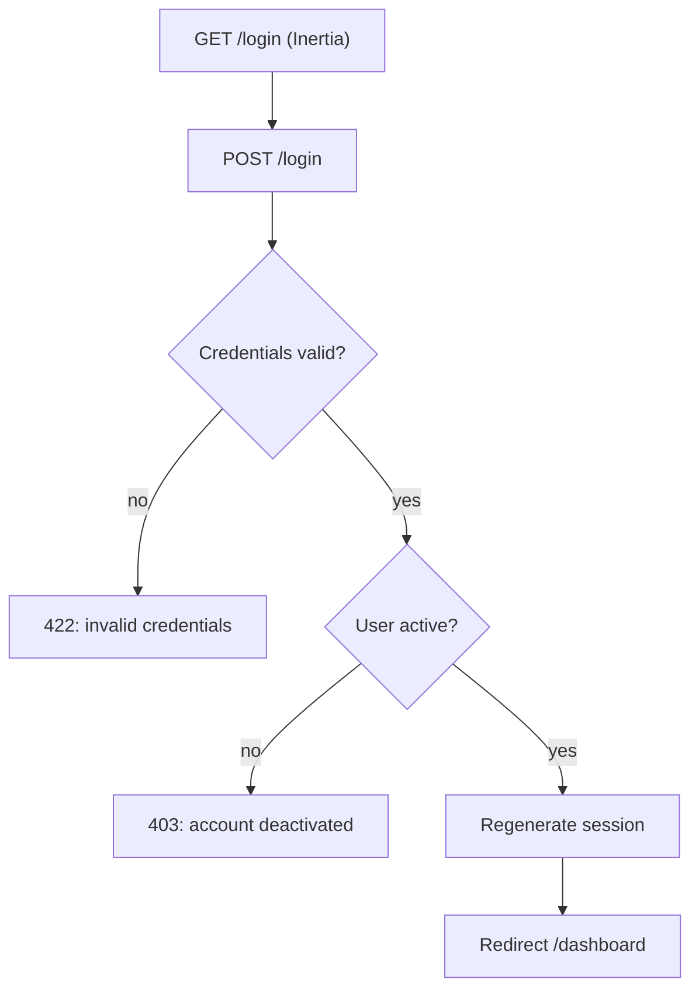

## Session & Security

- Session driver `database` (tablet stability; single active session per user enforced — older session invalidated on re-login).
- CSRF via Laravel defaults; Inertia CSRF cookie.
- Password policy: min 8 chars (Breeze default) — note in Open Questions Q6 (PH dentists often want weaker; keep default).
- Session lifetime 720 min (day-long clinic sessions), `'expire_on_close' => false` so tablets can sleep/wake without forcing re-login; login persists per device.

## Permissions

| Permission | Roles |
|---|---|
| `users.view` | administrator |
| `users.create` | administrator |
| `users.update` | administrator |
| `users.delete` | administrator |

## UI Elements (improvised)

- `/login` — centered card, large touch inputs, clinic logo.
- `/users` — admin-only table with role select, active toggle.
- Nav bar shows current user + role badge; logout button (≥44px touch).

## Seed Data

```php
// database/seeders/RolePermissionSeeder.php
collect(config('permissions'))->each(fn ($perm) => Permission::firstOrCreate(['name' => $perm]));
Role::create(['name' => 'Administrator'])->givePermissionTo(Permission::all());
Role::create(['name' => 'Dentist'])->givePermissionTo([... /* see 14-permissions.md */]);
Role::create(['name' => 'Assistant'])->givePermissionTo([...]);
Role::create(['name' => 'Receptionist'])->givePermissionTo([...]);
User::factory()->create(['name' => 'Admin', 'email' => 'admin@clinic.test'])->assignRole('Administrator');
```

---

# 04 — Patients (+ Medical History)

## Purpose

Central patient registry — every other module hangs off `patients`. Medical history is the pre-treatment screening captured in the wizard step 2.

## Database — `patients` (all 17 fields from spec §5)

```php
// 2026_01_01_000003_create_patients_table.php
Schema::create('patients', function (Blueprint $table) {
    $table->id();
    $table->string('patient_number', 20)->unique();          // e.g. 2026-0001 (see Q3)
    $table->string('first_name');
    $table->string('middle_name')->nullable();
    $table->string('last_name');
    $table->string('sex');                                    // Sex enum (male/female — see Q2)
    $table->date('birth_date');
    $table->string('civil_status')->default('single');        // CivilStatus enum
    $table->string('nationality')->default('Filipino');
    $table->string('occupation')->nullable();
    $table->string('contact_number');
    $table->string('address');
    $table->string('email_address')->nullable();
    $table->string('emergency_contact_person');
    $table->string('emergency_contact_number');
    $table->foreignId('created_by')->nullable()->constrained('users')->nullOnDelete();
    $table->softDeletes();                                    // Phase 4 archiving
    $table->timestamps();

    $table->index(['last_name', 'first_name']);
    $table->index('birth_date');
});
```

Age is **computed** (`$patient->age` accessor from `birth_date`) — never stored.

## Database — `medical_histories` (all 10 questions from spec §6)

```php
// 2026_01_01_000004_create_medical_histories_table.php
Schema::create('medical_histories', function (Blueprint $table) {
    $table->id();
    $table->foreignId('patient_id')->unique()->constrained()->cascadeOnDelete();
    // 10 screening questions (string = 'no' | 'yes' + details per item)
    $table->string('hypertension')->default('no');
    $table->string('diabetes')->default('no');
    $table->string('tuberculosis')->default('no');
    $table->string('heart_disease')->default('no');
    $table->string('pregnancy')->default('no');              // 'not_applicable' allowed for male/minor
    $table->string('allergies')->default('no');              // + allergies_details
    $table->string('medications')->default('no');            // + medications_details
    $table->string('smoking_history')->default('no');        // + smoking_details
    $table->string('alcohol_consumption')->default('no');    // + alcohol_details
    $table->string('previous_surgeries')->default('no');     // + surgeries_details
    // free-text details for each 'yes'
    $table->text('allergies_details')->nullable();
    $table->text('medications_details')->nullable();
    $table->text('smoking_details')->nullable();
    $table->text('alcohol_details')->nullable();
    $table->text('surgeries_details')->nullable();
    $table->text('remarks')->nullable();
    $table->foreignId('recorded_by')->nullable()->constrained('users')->nullOnDelete();
    $table->timestamps();
});
```

> Decision: fixed columns matching the spec exactly (simplest for the wizard). Dynamic question-bank design is deferred — see Q5.

## Enums

```php
enum Sex: string { case Male = 'male'; case Female = 'female'; /* meta() */ }

enum CivilStatus: string {
    case Single = 'single';
    case Married = 'married';
    case Widowed = 'widowed';
    case Separated = 'separated';
    case Divorced = 'divorced';
    case Annulled = 'annulled';
    case Other = 'other';
    // meta(): label, icon
}
```

Both extend `BaseEnum` (abstract class providing `labels()`, `meta()`, `fromMeta()`).

## Model

```php
class Patient extends Model
{
    use SoftDeletes, HasActivity;

    protected $guarded = [];

    protected function casts(): array
    {
        return ['birth_date' => 'date', 'sex' => Sex::class, 'civil_status' => CivilStatus::class];
    }

    public function getAgeAttribute(): int
    {
        return $this->birth_date->age;
    }

    public function fullName(): string
    {
        return trim("{$this->first_name} {$this->middle_name} {$this->last_name}");
    }

    public function scopeSearch($q, string $term): Builder   // name/number/contact
    {
        return $q->where('patient_number', 'like', "%$term%")
                 ->orWhere('last_name', 'like', "%$term%")
                 ->orWhere('first_name', 'like', "%$term%")
                 ->orWhere('contact_number', 'like', "%$term%");
    }

    public function medicalHistory(): HasOne { ... }
    public function appointments(): HasMany { ... }
    public function consultations(): HasMany { ... }
    public function chartEntries(): HasMany { ... }
    public function treatments(): HasMany { ... }
    public function attachments(): HasMany { ... }
    public function consentForms(): HasMany { ... }
}
```

## Service / Action

```php
final class RegisterPatientAction
{
    public function __construct(private PatientRepository $patients) {}

    public function handle(array $data, User $actor): Patient
    {
        DB::transaction(function () use ($data, $actor, &$patient) {
            $number = $this->patients->nextPatientNumber(now()->year);  // 2026-0001 ...
            $patient = Patient::create([...$data, 'patient_number' => $number, 'created_by' => $actor->id]);
            activity()->performedOn($patient)->causedBy($actor)->log('patient.registered');
        });
        return $patient;
    }
}
```

`PatientRepository::search(term, filters)` → paginated Inertia props; `nextPatientNumber(year)` → zero-padded sequence (`patients` count for year + 1 — see Q3 for format).

## Permissions

| Permission | Roles |
|---|---|
| `patients.view` | administrator, dentist, assistant, receptionist |
| `patients.create` | administrator, dentist, receptionist |
| `patients.update` | administrator, dentist, assistant |
| `patients.delete` | administrator (soft) |
| `medical-histories.view` | administrator, dentist |
| `medical-histories.create` | administrator, dentist |
| `medical-histories.update` | administrator, dentist |

## UI Elements (improvised — wizard step 1 & 2)

- **Step 1 — Patient form**: single-column stacked inputs (thumb-reachable), grouped: Identity / Contact / Emergency. "Register patient" primary button.
- **Step 2 — Medical history**: 10 yes/no segmented toggles with conditional "details" textarea appearing on *yes*; auto-skips to step 3.
- **Patient list** (`/patients`): search bar (name/number/contact), table rows ≥56px, tap → record view.
- **Record view** (`/patients/{id}`): summary header (avatar initials, age badge, patient number), tabbed sections (History, Appointments, Chart, Treatments, Files, Consents), each tab lazy-loads via Inertia partial reload.

---

# 05 — Appointments

## Purpose

Schedule, reschedule, cancel, and record attendance for patient visits (spec §7). Managed by Receptionist and Assistant.

## Database — `appointments`

```php
// 2026_01_01_000005_create_appointments_table.php
Schema::create('appointments', function (Blueprint $table) {
    $table->id();
    $table->foreignId('patient_id')->constrained()->cascadeOnDelete();
    $table->foreignId('dentist_id')->nullable()->constrained('users')->nullOnDelete(); // assigned dentist
    $table->date('appointment_date');
    $table->time('start_time');
    $table->time('end_time')->nullable();
    $table->string('reason')->nullable();                    // reason for visit / procedure intent
    $table->string('status')->default('pending');            // AppointmentStatus enum
    $table->text('notes')->nullable();
    $table->timestamp('attended_at')->nullable();            // attendance stamp (Completed / No-show)
    $table->foreignId('created_by')->nullable()->constrained('users')->nullOnDelete();
    $table->timestamps();

    $table->index(['appointment_date', 'status']);
    $table->index('dentist_id');
});
```

## Enum — `AppointmentStatus` (all 5 from spec §7)

```php
enum AppointmentStatus: string
{
    case Pending   = 'pending';
    case Confirmed = 'confirmed';
    case Completed = 'completed';
    case Cancelled = 'cancelled';
    case NoShow    = 'no_show';

    // meta(): label, color token (--color-status-*), icon
}
```

## State Machine

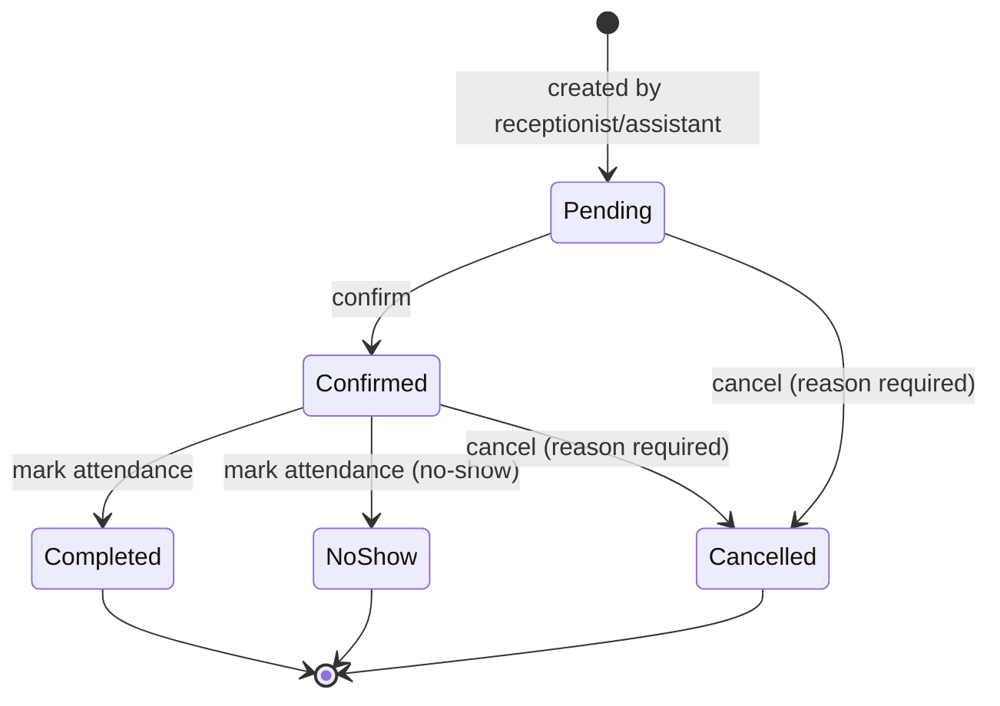

Transitions guarded in `AppointmentService`; invalid transitions throw `InvalidTransitionException` (422). No rescheduling after Completed.

## Service

```php
final class AppointmentService
{
    private const TRANSITIONS = [
        AppointmentStatus::Pending->value   => ['confirmed', 'cancelled'],
        AppointmentStatus::Confirmed->value => ['completed', 'no_show', 'cancelled'],
        AppointmentStatus::Completed->value => [],
        AppointmentStatus::NoShow->value    => [],
        AppointmentStatus::Cancelled->value => [],
    ];

    public function create(array $data, User $actor): Appointment
    public function reschedule(Appointment $a, array $data): Appointment   // date/time change; status back to 'pending'
    public function confirm(Appointment $a, User $actor): Appointment
    public function cancel(Appointment $a, string $reason, User $actor): Appointment
    public function markAttendance(Appointment $a, bool $present, User $actor): Appointment
    // each transition: checkTransition() → update status → activity()->log('appointment.confirmed') etc.
    public function overlaps(Appointment $a, Appointment $b): bool          // same dentist, overlapping time window
}
```

Rule: no overlapping appointments for the same `dentist_id` within the same time window (validation rule `AppointmentTimeWindow` — see Q7).

## Permissions

| Permission | Roles |
|---|---|
| `appointments.view` | administrator, dentist, assistant, receptionist |
| `appointments.create` | administrator, assistant, receptionist |
| `appointments.update` (reschedule) | administrator, assistant, receptionist |
| `appointments.cancel` | administrator, assistant, receptionist |
| `appointments.attendance` | administrator, assistant, receptionist |

## UI Elements (improvised)

- **Day view** (`/appointments`): date navigator (chevrons ≥44px), timeline list of appointments with patient name, time, status chip; tap → detail.
- **Create modal**: patient quick-search, date/time pickers, dentist select, reason.
- **Detail sheet**: status chip, action buttons rendered per state (Confirm / Cancel / Mark attended / Mark no-show / Reschedule), cancel requires reason input.
- **Dashboard widget** (spec §4 *Today's appointments*): same list condensed, tap-through.

---

# 06 — Consultations

## Purpose

Capture clinical findings per visit (spec §8). Wizard step 5. Created by Dentist only.

## Database — `consultations`

```php
// 2026_01_01_000006_create_consultations_table.php
Schema::create('consultations', function (Blueprint $table) {
    $table->id();
    $table->foreignId('patient_id')->constrained()->cascadeOnDelete();
    $table->foreignId('dentist_id')->constrained('users')->cascadeOnDelete();
    $table->date('consultation_date');
    $table->text('chief_complaint');
    $table->text('examination_findings')->nullable();
    $table->text('diagnosis')->nullable();
    $table->text('treatment_plan')->nullable();
    $table->text('recommendations')->nullable();
    $table->text('notes')->nullable();
    $table->timestamps();

    $table->index(['patient_id', 'consultation_date']);
});
```

## Model

```php
class Consultation extends Model
{
    use HasActivity;

    protected $guarded = [];

    protected function casts(): array
    {
        return ['consultation_date' => 'date'];
    }

    public function patient(): BelongsTo { ... }
    public function dentist(): BelongsTo { return $this->belongsTo(User::class, 'dentist_id'); }
    public function treatments(): HasMany { ... }   // treatments planned/executed from this consultation
}
```

## Service / Policy

```php
final class ConsultationService
{
    public function create(array $data, User $dentist): Consultation
    {
        DB::transaction(fn () =>
            Consultation::create([...$data, 'dentist_id' => $dentist->id])
        );
    }
}
```

- `ConsultationPolicy::update` → only the **authoring dentist** (or Administrator) may edit.
- Append-only philosophy: corrections create a new consultation rather than silent edits; policy exception above covers typos (activitylog records the diff).

## Permissions

| Permission | Roles |
|---|---|
| `consultations.view` | administrator, dentist |
| `consultations.create` | administrator, dentist |
| `consultations.update` | administrator, dentist |

## UI Elements (improvised)

- **Consultation form**: labeled textareas for all 6 spec fields; chief complaint required; auto-suggests treatments from the consultation (`/consultations/{id}/treatments/create`).
- Wizard step 5: single-column form, large textareas, "Save & continue to chart" primary action.
- Patient timeline: consultations listed newest-first with date chips.

---

# 07 — Dental Chart

## Purpose

Digitize the PDA paper dental chart (spec §9): adult + primary dentition, per-surface marking, color coding, and full historical records. Wizard step 6. The most complex module in the system.

## Design Decisions

1. **FDI tooth numbering** (ISO 3950) — adult quadrants 1–4 (teeth 11–48), primary quadrants 5–8 (teeth 51–85). Default choice; see Q1.
2. **Append-only event log**: every chart edit inserts a new `dental_chart_entries` row. The rendered chart = latest row per (tooth, surface). History view = all rows grouped by date. This gives the *historical records* requirement plus a complete audit trail at zero extra cost.
3. **Whole-tooth vs surface marks**: a condition can apply to the whole tooth (`surface = null`) or a specific surface (mesial/occlusal/buccal/lingual/distal). Rendering overlays per surface on the tooth shape.
4. **Color coding** driven by the `ToothCondition` enum `meta('color')` → Tailwind token (see 02-tech-stack.md).

## Database — `dental_chart_entries`

```php
// 2026_01_01_000007_create_dental_chart_entries_table.php
Schema::create('dental_chart_entries', function (Blueprint $table) {
    $table->id();
    $table->foreignId('patient_id')->constrained()->cascadeOnDelete();
    $table->unsignedTinyInteger('tooth_number');               // FDI: adult 11–48, primary 51–85
    $table->string('dentition')->default('adult');             // DentitionType enum
    $table->string('condition');                               // ToothCondition enum
    $table->string('surface')->nullable();                     // ToothSurface enum; null = whole tooth
    $table->string('color_code', 32)->nullable();              // denorm snapshot of condition color (rendering stability)
    $table->text('notes')->nullable();
    $table->date('recorded_at');                               // clinical date (may differ from created_at)
    $table->foreignId('recorded_by')->constrained('users')->cascadeOnDelete();
    $table->timestamps();

    $table->index(['patient_id', 'tooth_number', 'surface', 'recorded_at']);
});
```

No update/delete endpoints — entries are immutable. Corrections = new entry (same tooth/surface) which supersedes by recency.

## Enums

```php
enum DentitionType: string
{
    case Adult   = 'adult';
    case Primary = 'primary';

    // meta(): label ('Adult', 'Primary'), teethRange [11,48] / [51,85]
}

enum ToothCondition: string
{
    case Caries      = 'caries';      // red
    case Filling     = 'filling';     // blue
    case Missing     = 'missing';     // neutral gray
    case RootCanal   = 'root_canal';  // blue center dot
    case Crown       = 'crown';       // violet outline
    case Fracture    = 'fracture';    // orange zigzag
    case Impacted    = 'impacted';    // amber, un-erupted
    case Pontic      = 'pontic';      // teal bridge tooth
    // meta(): label, color token, fill mode (solid/outline/dot/zigzag), toggleable (missing/pontic are whole-tooth only)
}

enum ToothSurface: string
{
    case Occlusal = 'occlusal';
    case Buccal   = 'buccal';
    case Lingual  = 'lingual';
    case Mesial   = 'mesial';
    case Distal   = 'distal';
    // meta(): label, position on tooth SVG (top/left/right/bottom)
}
```

## Model + Chart Projection (Service)

```php
class DentalChartEntry extends Model
{
    use HasActivity;

    protected $guarded = [];
    protected function casts(): array
    {
        return [
            'dentition'   => DentitionType::class,
            'condition'   => ToothCondition::class,
            'surface'     => ToothSurface::class,
            'recorded_at' => 'date',
        ];
    }
}
```

```php
final class DentalChartService
{
    /**
     * Latest state per (tooth, surface) — the rendered chart.
     * Returns array keyed by tooth_number → ['whole' => Condition?, 'surfaces' => [surface => Condition]]
     */
    public function currentState(int $patientId, DentitionType $dentition): array
    {
        return DentalChartEntry::where('patient_id', $patientId)
            ->where('dentition', $dentition->value)
            ->orderBy('recorded_at')
            ->orderBy('id')
            ->get()
            ->groupBy('tooth_number')
            ->map(fn ($rows) => $this->projectLatestPerSurface($rows))
            ->toArray();
    }

    /** Full historical log for a tooth or date range */
    public function history(int $patientId, ?int $toothNumber = null, ?Carbon $from = null): Collection { ... }

    /** Snapshot an entry (currentState for one tooth) for chart restoration */
    public function snapshot(int $patientId): array { ... }
}
```

`RecordToothConditionAction::handle(patient, tooth, dentition, condition, surface, recordedAt, dentist)` — validates FDI range, inserts immutable row, logs activity `chart.updated`.

## State Machine

None — the chart is an append-only log, not a stateful entity. The only "transition" is supersession by recency (newest entry wins).

## Permissions

| Permission | Roles |
|---|---|
| `dental-chart.view` | administrator, dentist, assistant |
| `dental-chart.update` | administrator, dentist |

## UI Elements (improvised — no Figma)

- **ToothChart component** (`resources/js/Components/ToothChart.vue`): SVG twin-arch diagram — upper arch (11–18 / 51–55), lower arch (41–48 / 71–75), mirrored patient's-right/left. Tooth shape with 5 clickable surface zones (O/B/L/M/D) + whole-tooth click.
- **Condition palette** (`ToothLegend`): 8 color chips (condition → OKLCH token), selected condition highlights; tap tooth/surface applies.
- **Dentition toggle**: Adult / Primary segmented control; chart switches tooth set.
- **History drawer**: date slider or list; selecting a past date renders the chart state **as of that date** (entries with `recorded_at ≤ date`).
- **Color coding legend** always visible on chart screen.

## Rendering Rules (improvised defaults)

| Condition | Whole tooth | Surface | Render |
|---|---|---|---|
| Caries | ✓ | ✓ | solid red fill (surface zone) |
| Filling | ✓ | ✓ | solid blue fill |
| Missing | ✓ | ✗ | gray tooth with X (hidden in chart count) |
| Root canal | ✓ | ✗ | blue dot at center |
| Crown | ✓ | ✗ | violet outline ring |
| Fracture | ✓ | ✓ | orange zigzag line across zone |
| Impacted | ✓ | ✗ | amber tooth, dashed outline |
| Pontic | ✓ | ✗ | teal tooth, lighter fill |

---

# 08 — Treatment Records

## Purpose

Log procedures performed per patient (spec §10), including the **dentist's electronic signature on treatment forms** (*Sign treatment forms* — dentist role permission). Wizard step 7.

## Database — `treatments`

```php
// 2026_01_01_000008_create_treatments_table.php
Schema::create('treatments', function (Blueprint $table) {
    $table->id();
    $table->foreignId('patient_id')->constrained()->cascadeOnDelete();
    $table->foreignId('consultation_id')->nullable()->constrained()->nullOnDelete(); // optional link
    $table->unsignedTinyInteger('tooth_number')->nullable();  // FDI; null = non-tooth procedure
    $table->string('procedure_name');
    $table->text('description')->nullable();
    $table->text('notes')->nullable();
    $table->foreignId('dentist_id')->constrained('users')->cascadeOnDelete();
    $table->date('treatment_date');
    // electronic signature — dentist signs the treatment form on tablet
    $table->string('signature_path')->nullable();             // SVG file path (see SignatureStorageService)
    $table->timestamp('signed_at')->nullable();
    $table->timestamps();

    $table->index(['patient_id', 'treatment_date']);
});
```

> No `fee` column — billing explicitly out of scope (Q8).

## Model

```php
class Treatment extends Model
{
    use HasActivity;

    protected $guarded = [];

    protected function casts(): array
    {
        return ['treatment_date' => 'date', 'signed_at' => 'datetime'];
    }

    public function patient(): BelongsTo { ... }
    public function consultation(): BelongsTo { ... }
    public function dentist(): BelongsTo { return $this->belongsTo(User::class, 'dentist_id'); }

    public function isSigned(): bool { return $this->signed_at !== null; }
}
```

## Service

```php
final class TreatmentService
{
    /** Create treatment + optional auto-sign */
    public function create(array $data, User $dentist): Treatment

    /** Dentist signs the treatment form; captures signature SVG, stamps signed_at */
    public function sign(Treatment $treatment, string $signatureSvg, User $dentist): Treatment
    {
        // Guards: only authoring dentist or admin (TreatmentPolicy::sign)
        $path = SignatureStorageService::store($signatureSvg, "signatures/treatments/{$treatment->id}.svg");
        $treatment->update(['signature_path' => $path, 'signed_at' => now()]);
        activity()->performedOn($treatment)->causedBy($dentist)->log('treatment.signed');
        return $treatment;
    }
}
```

## Signing Flow

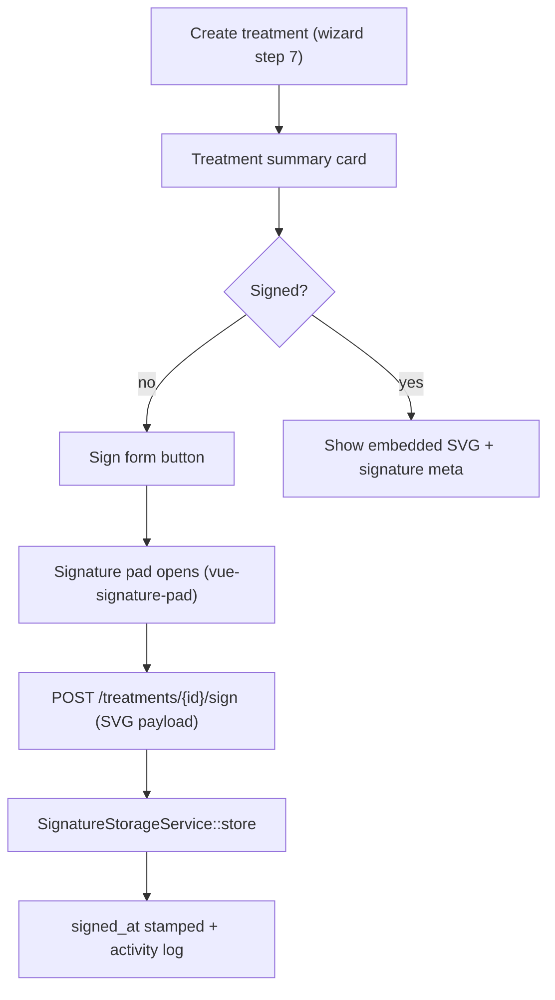

## Permissions

| Permission | Roles |
|---|---|
| `treatments.view` | administrator, dentist |
| `treatments.create` | administrator, dentist |
| `treatments.update` | administrator, dentist |
| `treatments.sign` | administrator, dentist |

## UI Elements (improvised)

- **Treatment form**: procedure select (free text with datalist of common procedures), tooth number input (numeric keypad-friendly), description/notes textareas, date picker.
- **Signature pad**: full-screen overlay on tablet, canvas 300×150+, "Clear" + "Accept signature" buttons (≥44px), stores SVG.
- **Treatment list** on patient record: signed badge (✓ signature icon) vs pending; tap → detail with embedded signature image.

---

# 09 — File Attachments

## Purpose

Store per-patient documents (spec §11): images, PDFs, X-rays, prescriptions, laboratory results. Uploaded mainly by Assistant (*Upload attachments*).

## Database — `attachments`

```php
// 2026_01_01_000009_create_attachments_table.php
Schema::create('attachments', function (Blueprint $table) {
    $table->id();
    $table->foreignId('patient_id')->constrained()->cascadeOnDelete();
    $table->foreignId('uploaded_by')->nullable()->constrained('users')->nullOnDelete();
    $table->string('category')->default('image');        // AttachmentCategory enum
    $table->string('original_name');
    $table->string('file_path');                          // storage path on local disk (default) / S3
    $table->string('mime_type');
    $table->unsignedBigInteger('file_size');              // bytes
    $table->text('notes')->nullable();
    $table->timestamps();

    $table->index(['patient_id', 'category']);
});
```

## Enum

```php
enum AttachmentCategory: string
{
    case Image        = 'image';
    case Pdf          = 'pdf';
    case Xray         = 'xray';
    case Prescription = 'prescription';
    case Laboratory   = 'laboratory';
    case Document     = 'document';
    case Other        = 'other';
    // meta(): label, icon
}
```

## Storage Strategy

- Default disk: `local` under `storage/app/uploads/{patient_id}/` — see cross-cutting (12) for S3 option + backup tie-in.
- File naming: `{uuid}.{ext}` — original name preserved only in `original_name`.
- Validation: `mimes:jpeg,png,gif,webp,pdf` + max 25 MB (Q9); X-ray category allows larger limit.
- Upload endpoint streams with progress (`axios` `onUploadProgress` in Pinia store) — tablet uploads of multi-MB X-rays need feedback.
- **No hard deletes** (medico-legal): `attachments.delete` permission → soft-delete flag? Decision: `deleted_at` column added via policy-enabled soft delete; only Administrator can delete, audit-logged.

## Service

```php
final class AttachmentService
{
    public function store(UploadedFile $file, array $data, User $uploader): Attachment
    {
        $path = $file->store("uploads/{$data['patient_id']}", 'local');
        $attachment = Attachment::create([...$data, 'file_path' => $path, 'uploaded_by' => $uploader->id]);
        activity()->performedOn($attachment)->causedBy($uploader)->log('attachment.uploaded');
        return $attachment;
    }

    public function stream(Attachment $attachment): StreamedResponse   // inline view for X-ray/DICOM-ish display
}
```

## Permissions

| Permission | Roles |
|---|---|
| `attachments.view` | administrator, dentist, assistant |
| `attachments.upload` | administrator, dentist, assistant |
| `attachments.delete` | administrator |

## UI Elements (improvised)

- **File list tab** on patient record: category icon chips, thumbnail grid for images/X-rays, tap → lightbox/preview modal (PDF → iframe embed).
- **Upload button** (≥44px): file picker with category selector before confirm; progress bar during upload.
- X-ray viewing: full-screen dark mode viewer with pinch-zoom (tablet).

---

# 10 — Waiver & Informed Consent

## Purpose

Capture the patient's digital signature on the PDA-informed-consent waiver directly on the tablet (spec §12, §14). Wizard step 3 (before consultation — patient-facing).

## Database — `consent_forms`

```php
// 2026_01_01_000010_create_consent_forms_table.php
Schema::create('consent_forms', function (Blueprint $table) {
    $table->id();
    $table->foreignId('patient_id')->constrained()->cascadeOnDelete();
    $table->string('version', 10)->default('1.0');            // template version
    $table->text('consent_text');                             // SNAPSHOT of the waiver wording at signing time
    $table->string('patient_name');                           // captured, not derived — printed on form
    $table->string('patient_signature_path');
    $table->string('guardian_name')->nullable();              // required if minor (Q4)
    $table->string('guardian_signature_path')->nullable();
    $table->foreignId('dentist_id')->constrained('users')->cascadeOnDelete();
    $table->string('dentist_signature_path')->nullable();     // dentist countersigns (spec §12 signature section)
    $table->timestamp('patient_signed_at')->nullable();
    $table->timestamp('dentist_signed_at')->nullable();
    $table->string('ip_address')->nullable();                 // device audit
    $table->string('user_agent')->nullable();
    $table->string('status')->default('unsigned');            // ConsentStatus enum
    $table->timestamps();

    $table->index(['patient_id', 'status']);
});
```

## Enum — `ConsentStatus`

```php
enum ConsentStatus: string
{
    case Unsigned      = 'unsigned';
    case PatientSigned = 'patient_signed';
    case Signed        = 'signed';       // both patient + dentist
    case Voided        = 'voided';       // replaced by a newer consent (re-sign)
    // meta(): label, color token
}
```

## State Machine

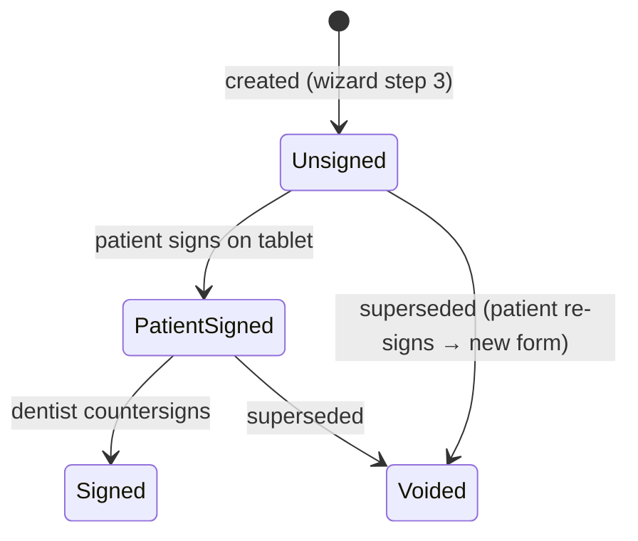

## Service

```php
final class ConsentService
{
    public function createDraft(Patient $patient, User $dentist): ConsentForm
    {
        // Snapshot current template: ConsentTemplate::current() → ['version' => '1.0', 'text' => '...']
        return ConsentForm::create([...]);
    }

    public function signPatient(ConsentForm $form, string $signatureSvg, ?string $guardianName, ?string $guardianSvg): ConsentForm
    {
        // Guard: patient must be present; guardian required when patient.age < 18 (Q4)
        $form->update([
            'patient_signature_path' => SignatureStorageService::store($svg, "signatures/consents/{$form->id}-patient.svg"),
            'guardian_name'          => $guardianName,
            'guardian_signature_path'=> $guardianSvg ? store(...) : null,
            'patient_signed_at'      => now(),
            'status'                 => ConsentStatus::PatientSigned->value,
            'ip_address'             => request()->ip(),
            'user_agent'             => request()->userAgent(),
        ]);
        activity()->performedOn($form)->log('consent.patient_signed');
        return $form;
    }

    public function signDentist(ConsentForm $form, string $signatureSvg, User $dentist): ConsentForm { ... }
    // → status = Signed, dentist_signed_at stamped

    public function voidAndRecreate(ConsentForm $form, User $actor): ConsentForm
    // void old → createDraft(new) — chained when patient re-signs
}
```

## Signature Capture (spec §14)

- Library: `szimek/signature_pad` via `vue-signature-pad` (Vue 3 wrapper).
- Export as **SVG data URL** (`toDataURL('image/svg+xml')`) → sent as JSON to server → `SignatureStorageService` writes vector SVG to `storage/app/signatures/`.
- Vector SVG chosen over PNG: tiny size, infinitely zoomable for legal/print reproduction, no pixelation when printed on A4.
- Pad spec: ≥300×150 logical px canvas, ink color `oklch(0.18 0 0)` (near-black), smoothing enabled, "Clear" + "Accept" buttons ≥44px.

## Consent Template (spec §12 text, verbatim)

Stored as a **config/template** (`ConsentTemplate` model or `config/consent.php`) — the §12 paragraphs:

> I voluntarily authorize the attending dentist to perform the procedures that have been explained to me.
> I understand that dentistry is not an exact science and that no guarantee has been made regarding the outcome of treatment.
> I acknowledge that unforeseen conditions may require additional procedures.
> I understand the risks associated with dental treatment, including discomfort, bleeding, infection, allergic reactions, swelling, and the possibility of complications.
> I consent to the collection, storage, and processing of my personal information for medical, administrative, and legal purposes.
> I certify that the information I have provided is complete and accurate.

Signature section (printed on the signed form): **Patient name / Patient signature / Parent-guardian / Dentist / Date** (spec §12 block).

## Permissions

| Permission | Roles |
|---|---|
| `consents.view` | administrator, dentist, assistant |
| `consents.create` | administrator, dentist, assistant |
| `consents.sign-patient` | administrator, dentist, assistant (device held by staff; patient draws) |
| `consents.sign-dentist` | administrator, dentist |

## UI Elements (improvised — patient-facing step)

- **Waiver screen** (wizard step 3): scrollable consent text (≥16px, high contrast), checkbox "I have read and understood", then signature canvas.
- **Patient signs first** → guardian signature appears if patient < 18 (guardian name field pre-filled from patient contact).
- **Dentist countersign** step runs at consultation end (step 5→6 boundary) or treatment time.
- Signed form → rendered as printable A4 layout (SVG signatures embedded) → PDF export via browser print.

---

# 11 — Dashboard, Reports & Settings

## Purpose

Operational day-start screen (spec §4), admin-only reporting (spec §3), and key-value clinic settings.

## Dashboard Widgets (spec §4 — no dedicated tables; all read-model queries)

| Widget | Query | Roles |
|---|---|---|
| Today's appointments | `appointments` where date = today, ordered by start_time, status in (pending, confirmed) | all |
| Recent patients | latest 10 `patients` by created_at | all |
| Pending procedures | `treatments` where `signed_at IS NULL` count + list | dentist, admin |
| Monthly statistics | count: new patients / appointments / treatments / consents this month | admin, dentist |
| Follow-up appointments | `appointments` next 7 days, status confirmed, flagged follow-up | receptionist, assistant, dentist |

> Follow-up flag: `appointments.reason` free-text per spec — a dedicated `is_follow_up` boolean is added (Q11). Widget uses it.

## Reports (admin-only per spec §3)

`ReportRepository` — no tables, aggregation queries returning JSON consumed by Inertia pages:

```php
final class ReportRepository
{
    /** new patients per month (last 12 months) */
    public function patientGrowth(Carbon $from, Carbon $to): Collection
    /** appointments by status per month; attendance rate = completed / (completed+no_show) */
    public function appointmentSummary(Carbon $from, Carbon $to): Collection
    /** procedure counts grouped by procedure_name, optional tooth/dentist filter */
    public function procedureSummary(Carbon $from, Carbon $to): Collection
    /** top conditions on chart (caries, missing, rct...) — clinical audit */
    public function conditionSummary(Carbon $from, Carbon $to): Collection
    /** per-dentist treatment counts — workload */
    public function dentistWorkload(Carbon $from, Carbon $to): Collection
}
```

- Exports: CSV + printable PDF (browser print of a report view). PDF library (DomPDF) optional — default browser print, Q12.
- All reports filtered by date range; all admin-only.

## Settings

```php
// 2026_01_01_000011_create_settings_table.php
Schema::create('settings', function (Blueprint $table) {
    $table->id();
    $table->string('key')->unique();
    $table->text('value')->nullable();      // JSON-encoded where needed
    $table->string('group')->default('general');
    $table->timestamps();
});
```

| Seed key | Purpose |
|---|---|
| `clinic.name` | header / reports branding |
| `clinic.address` | consent form print footer |
| `consent.version` | current waiver template version |
| `patient.number.prefix` | patient number scheme (Q3) |
| `appointment.overlap` | allow overlapping appointments (`false` default) |
| `attachment.max_size_mb` | upload cap (default 25) |

`Settings` model with `SettingsService::get(key, default)` + cache (60s). Managed by Administrator (`settings.update`).

## Permissions

| Permission | Roles |
|---|---|
| `reports.view` | administrator |
| `settings.view` | administrator |
| `settings.update` | administrator |

## UI Elements (improvised)

- **Dashboard** (`/dashboard`): widget cards grid (2-col on tablet, 4-col desktop); each card = title + count + tap-to-drill.
- **Reports** (`/reports`): date range picker, metric cards, line/bar charts (chart.js or lightweight SVG — default `chart.js` + vue wrapper, Q13), export buttons.
- **Settings** (`/settings`): grouped form, key-value rows rendered by group, save button with toast.

---

# 12 — Cross-Cutting Concerns

## Tenancy & Portals

- **Single tenant, single clinic** — no `branch_id`, no tenant middleware. Decision tree: no branches → simple CRUD.
- **Single portal** (clinic staff web app). No patient/mobile portal. Tablet is just a web browser client of the same app; responsive layout handles it. No separate guard middleware needed (unlike the multi-portal pattern).

## Audit Trail

`spatie/laravel-activitylog` on clinical + administrative entities:

| Entity | Logged events |
|---|---|
| Patient | registered, updated, deleted (soft) |
| Appointment | created, confirmed, cancelled, rescheduled, attended, no_show |
| Consultation | created, updated |
| DentalChartEntry | updated (each immutable insert) |
| Treatment | created, signed |
| Attachment | uploaded, deleted |
| ConsentForm | patient_signed, dentist_signed, voided |
| User | created, role_changed, deactivated |

Audit rows: `causer_id`, `subject_type/id`, `event`, `properties` (diff of changes), `ip_address`, `created_at`. Retention: indefinite (medico-legal); part of Phase 4 archival.

## File Storage

- Default disk `local`: `storage/app/uploads/{patient_id}/`, `storage/app/signatures/`.
- Production option: `s3` disk (X-rays/PDFs) — Q14. Storage config abstracted behind `AttachmentService`/`SignatureStorageService` so swap is one env change.
- Both disks behind **backup pipeline** (below).

## Backup & Archiving (spec §16 Phase 4)

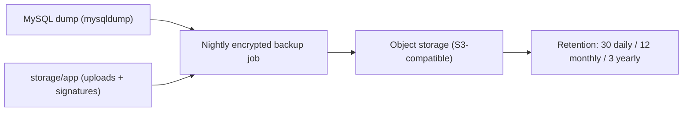

- `laravel-backup` package (Spatie) on schedule: `database` + `local` disk → S3.
- **Archiving**: patients `deleted_at` after N years inactivity (configurable, default 5, Q15); archive job exports soft-deleted patient full record (chart, consents, attachments) to immutable archive bucket then hard-deletes.
- Restore drill: monthly (documented in runbook).

## Caching & Queues

- Cache: `settings` keys (60s), patient search hot lists (5 min), dashboard widget queries (2 min).
- Queues: `database` driver; jobs — backup, archive, report exports (sync in v1 is acceptable; queue when report volume grows).
- Horizon unnecessary at this scale (single clinic).

## Sessions & Tablet Behavior

- Session driver `database`; long-lived (720 min), `expire_on_close=false` — tablets sleep/wake without re-auth.
- Tablets share the staff account (session per user is fine; only one device per user assumption — Q16).
- PWA/offline: **out of scope v1** (clinic Wi-Fi assumed). Open question Q17.

## Error Handling

- 419 (CSRF expiry on sleeping tablet) → auto-refresh to login page with preserved Inertia props; toast "Session expired".
- 500 page: friendly tablet-sized error with incident id (log context).
- Validation errors: Inertia `$errors` inline under fields, red highlight, scroll-to-first-error.

## API Surface Summary (endpoints with JSON responses)

| Endpoint | Purpose | Auth |
|---|---|---|
| `POST /api/signatures` | store signature SVG → path | auth + policy |
| `POST /treatments/{id}/sign` | sign treatment form | `treatments.sign` |
| `POST /consents/{id}/patient-sign` | patient + guardian sign | `consents.sign-patient` |
| `POST /consents/{id}/dentist-sign` | dentist countersign | `consents.sign-dentist` |
| `POST /attachments` | chunked upload with progress | `attachments.upload` |
| `POST /dental-chart/entries` | immutable chart entry | `dental-chart.update` |
| `GET /patients/{id}/chart?as_of=date` | historical chart state | `dental-chart.view` |
| `GET /reports/*` | report data (Inertia page) | `reports.view` |

Everything else is Inertia page navigation (page + data in one response).

---

# 13 — API Contracts

## Routing Conventions

- Inertia pages: `GET /patients`, `GET /patients/{patient}` etc. — return `Inertia::render`.
- State-changing (POST/PATCH/DELETE) → 303 redirect back with Inertia toast (`success`).
- JSON endpoints (signatures, chart entries, uploads) → JSON responses, no redirect.
- Named routes via Ziggy (`route('patients.show', id)` in JS).

## Page Routes

| Route | Page | Permission |
|---|---|---|
| `GET /login` | `Auth/Login` | guest |
| `GET /dashboard` | `Dashboard/Index` | authenticated |
| `GET /patients` | `Patients/Index` | patients.view |
| `GET /patients/create` | `Patients/Create` | patients.create |
| `GET /patients/{patient}` | `Patients/Show` | patients.view |
| `PATCH /patients/{patient}` | — | patients.update |
| `DELETE /patients/{patient}` | — | patients.delete |
| `GET /wizard/{patient?}` | `Wizard/Index` | patients.view (multi-step intake) |
| `GET /appointments` | `Appointments/Index` | appointments.view |
| `POST /appointments` · `PATCH /appointments/{a}` | — | appointments.create / update |
| `POST /appointments/{a}/attendance` | — | appointments.attendance |
| `GET /consultations` | `Consultations/Index` | consultations.view |
| `GET /dental-chart` | `DentalChart/Index` | dental-chart.view |
| `GET /treatments` | `Treatments/Index` | treatments.view |
| `GET /attachments` | `Attachments/Index` | attachments.view |
| `GET /consents` | `Consents/Index` | consents.view |
| `GET /reports` | `Reports/Index` | reports.view |
| `GET /settings` | `Settings/Index` | settings.view |
| `GET /users` | `Users/Index` | users.view |

## JSON Endpoints

| Method + Path | Body | Success | Errors |
|---|---|---|---|
| `POST /api/signatures` | `{ svg: string }` | `200 { path }` | 422 malformed, 413 too large, 403 |
| `POST /treatments/{treatment}/sign` | `{ svg }` | `200 { signed_at, path }` | 403, 422, 404 |
| `POST /consents/{form}/patient-sign` | `{ svg, guardian_name?, guardian_svg? }` | `200 { status }` | 422 (minor w/o guardian), 403 |
| `POST /consents/{form}/dentist-sign` | `{ svg }` | `200 { status }` | 403, 422 |
| `POST /attachments` | multipart: `file, category, patient_id` | `201 { attachment }` | 413 > max size, 422 type |
| `POST /dental-chart/entries` | `{ tooth_number, dentition, condition, surface?, recorded_at, notes? }` | `201 { entry }` | 422 FDI range, 403 |
| `GET /patients/{patient}/chart?as_of=YYYY-MM-DD&dentition=adult` | — | `200 { state }` | 404 |

## Response Format

- **JSON success**: `{ data: ... }` (no envelope).
- **JSON error**: `{ message, errors?: {...} }` with proper HTTP code.
- **Inertia errors**: Laravel validation → `$errors` prop; redirect back with `$message` flash for toasts.

## Error Codes

| Code | Meaning | UI |
|---|---|---|
| 401 | unauthenticated (session expired on tablet) | redirect login |
| 403 | permission denied (policy) | toast "Not allowed" |
| 404 | record missing / soft-deleted | toast |
| 409 | conflicting state (e.g., appointment already completed) | toast + refresh |
| 413 | file too large | upload error inline |
| 419 | CSRF token mismatch (sleeping tablet) | auto login redirect |
| 422 | validation failed | inline field errors |
| 429 | rate limited | toast + retry-after |

## Validation Conventions

- FormRequests per write endpoint (`CreatePatientRequest`, `SignTreatmentRequest`...).
- Tooth validation: `Rule::toothNumber(dentition)` — FDI range 11–48 / 51–85.
- Signature SVG: must parse as SVG (libxml), max 512 KB, sanitized (no scripts/foreign objects).
- Appointment time window: no overlap with same dentist (unless `appointment.overlap` setting).

## Rate Limiting

- Login: 5/min per email+IP (prevents brute force on clinic tablets).
- Signature endpoints: 10/min.
- Uploads: 20/hour per user.
- Global API: 120/min per user (middleware `throttle`).

## Pagination & Filtering

- List pages: `?page=`, `?per_page=` (default 20), `?search=` (patients: name/number/contact), `?status=`, `?date=`.
- Sorted by: patients `created_at desc`; appointments `appointment_date, start_time asc`; clinical lists `recorded_at/treatment_date desc`.

---

# 14 — Permissions

Installable catalogue — copy to `config/permissions.php`. Seed via `RolePermissionSeeder` (see 03-auth.md).

## config/permissions.php

```php
<?php

// config/permissions.php — DCPRS RBAC catalogue
return [

    'users' => ['users.view', 'users.create', 'users.update', 'users.delete'],

    'patients' => ['patients.view', 'patients.create', 'patients.update', 'patients.delete'],

    'medical-histories' => ['medical-histories.view', 'medical-histories.create', 'medical-histories.update'],

    'appointments' => [
        'appointments.view',
        'appointments.create',
        'appointments.update',       // reschedule / edit
        'appointments.cancel',
        'appointments.attendance',   // mark completed / no-show
    ],

    'consultations' => ['consultations.view', 'consultations.create', 'consultations.update'],

    'dental-chart' => ['dental-chart.view', 'dental-chart.update'],

    'treatments' => ['treatments.view', 'treatments.create', 'treatments.update', 'treatments.sign'],

    'attachments' => ['attachments.view', 'attachments.upload', 'attachments.delete'],

    'consents' => [
        'consents.view',
        'consents.create',
        'consents.sign-patient',
        'consents.sign-dentist',
    ],

    'reports' => ['reports.view'],

    'settings' => ['settings.view', 'settings.update'],
];
```

**Total: 35 permissions.**

## Role Matrix (seeder mapping)

| Permission | Admin | Dentist | Assistant | Receptionist |
|---|:---:|:---:|:---:|:---:|
| users.* (4) | ✓ | | | |
| patients.view | ✓ | ✓ | ✓ | ✓ |
| patients.create | ✓ | ✓ | | ✓ |
| patients.update | ✓ | ✓ | ✓ | |
| patients.delete | ✓ | | | |
| medical-histories.view | ✓ | ✓ | | |
| medical-histories.create/update | ✓ | ✓ | | |
| appointments.view | ✓ | ✓ | ✓ | ✓ |
| appointments.create | ✓ | | ✓ | ✓ |
| appointments.update | ✓ | | ✓ | ✓ |
| appointments.cancel | ✓ | | ✓ | ✓ |
| appointments.attendance | ✓ | | ✓ | ✓ |
| consultations.* (3) | ✓ | ✓ | | |
| dental-chart.view | ✓ | ✓ | ✓ | |
| dental-chart.update | ✓ | ✓ | | |
| treatments.* (4) | ✓ | ✓ | | |
| attachments.view | ✓ | ✓ | ✓ | |
| attachments.upload | ✓ | ✓ | ✓ | |
| attachments.delete | ✓ | | | |
| consents.view | ✓ | ✓ | ✓ | |
| consents.create | ✓ | ✓ | ✓ | |
| consents.sign-patient | ✓ | ✓ | ✓ | |
| consents.sign-dentist | ✓ | ✓ | | |
| reports.view | ✓ | | | |
| settings.* (2) | ✓ | | | |

## Mapping to Spec §3

| Spec statement | Implemented as |
|---|---|
| Admin: Create users | `users.create` |
| Admin: Manage settings | `settings.*` |
| Admin: View reports | `reports.view` |
| Admin: Manage records | all `*.*` (admin gets everything) |
| Dentist: Create patient records | `patients.create` |
| Dentist: Create consultations | `consultations.create` |
| Dentist: Update dental charts | `dental-chart.update` |
| Dentist: Create treatment records | `treatments.create` |
| Dentist: Sign treatment forms | `treatments.sign` (+ `consents.sign-dentist`) |
| Assistant: Upload attachments | `attachments.upload` |
| Assistant: Manage appointments | `appointments.*` |
| Assistant: Update patient records | `patients.update` |
| Receptionist: Register patients | `patients.create` |
| Receptionist: Schedule appointments | `appointments.create/update/cancel` |
| Receptionist: Search patient records | `patients.view` (search within list) |

## Policy Notes

- `patients.delete` is soft-delete only; clinical history (chart/consents/treatments) is never destroyed — Admin policy enforces this.
- `attachments.delete` → soft delete + audit (medico-legal).
- `ConsultationPolicy::update`, `TreatmentPolicy::update/sign` — author-scoped (authoring dentist or admin), enforced in addition to permission.
- Every JSON endpoint cross-checks permission + policy (defense in depth).

---

# 15 — Migration Order

Numbered, dependency-ordered. All anonymous-class migrations; no MySQL `enum()`.

| # | Migration | Depends on | Notes |
|---|---|---|---|
| 01 | `create_users_table` | — | auth base |
| 02 | Spatie RBAC migrations (published) | 01 | `roles`, `permissions`, `model_has_roles`, `model_has_permissions`, `role_has_permissions` |
| 03 | `create_patients_table` | 01 | FK `created_by` → users; soft deletes |
| 04 | `create_medical_histories_table` | 03 | FK `patient_id` unique; FK `recorded_by` → users |
| 05 | `create_appointments_table` | 03, 01 | FKs `patient_id`, `dentist_id`, `created_by` |
| 06 | `create_consultations_table` | 03, 01 | FKs `patient_id`, `dentist_id` |
| 07 | `create_dental_chart_entries_table` | 03, 01 | FKs `patient_id`, `recorded_by`; immutable log |
| 08 | `create_treatments_table` | 03, 06, 01 | FKs `patient_id`, `consultation_id` nullable, `dentist_id` |
| 09 | `create_attachments_table` | 03, 01 | FKs `patient_id`, `uploaded_by` |
| 10 | `create_consent_forms_table` | 03, 01 | FKs `patient_id`, `dentist_id`; text snapshots + signature paths |
| 11 | `create_settings_table` | — | key-value, unique `key` |
| 12 | `create_activity_log_table` | — | spatie/laravel-activitylog published migration |

## Dependency Graph

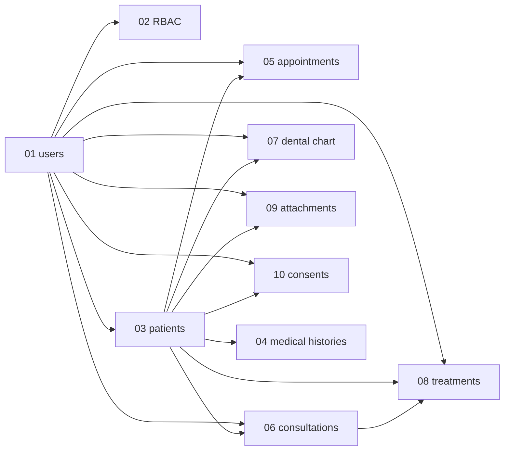

## Seed Order

1. `RolePermissionSeeder` — 35 permissions + 4 roles (must run before any user creation).
2. `SettingsSeeder` — clinic.name, consent.version=1.0, etc.
3. `AdminUserSeeder` — default admin (`admin@clinic.test`).

---

# 16 — ERD & State Machines

## Master ERD

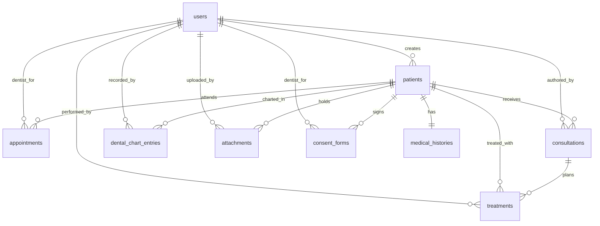

## Domain Island: Clinical Core

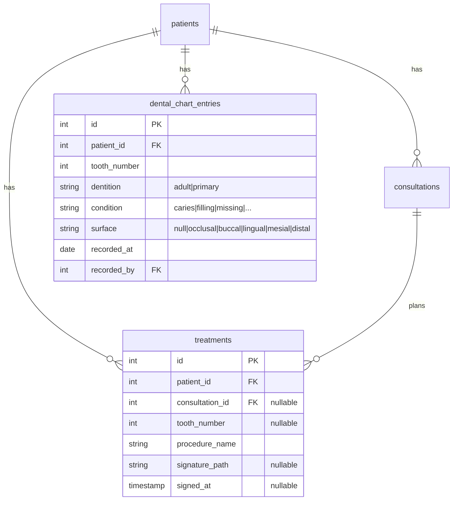

## Domain Island: Consents (legal chain)

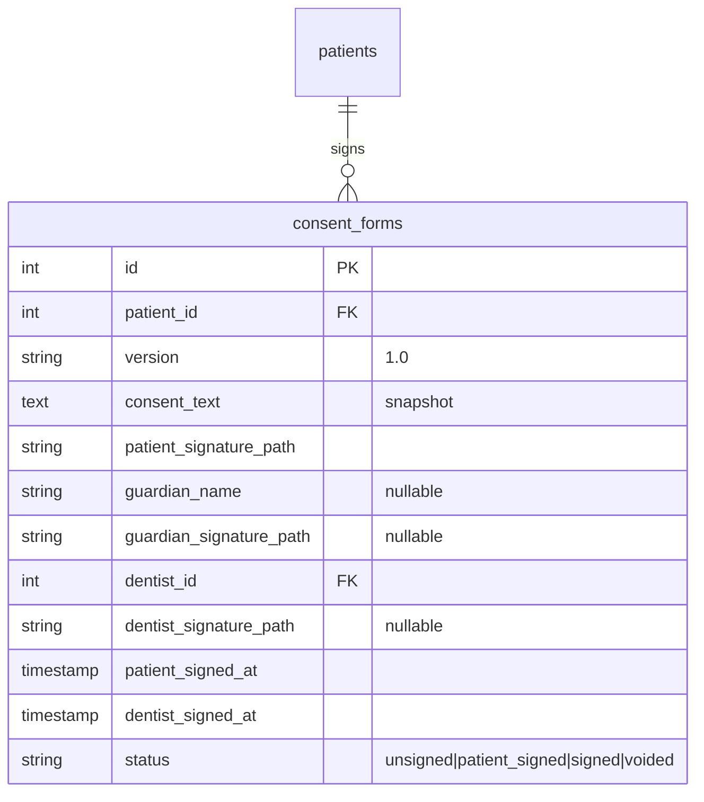

## State Machine: Appointment (spec §7 statuses)

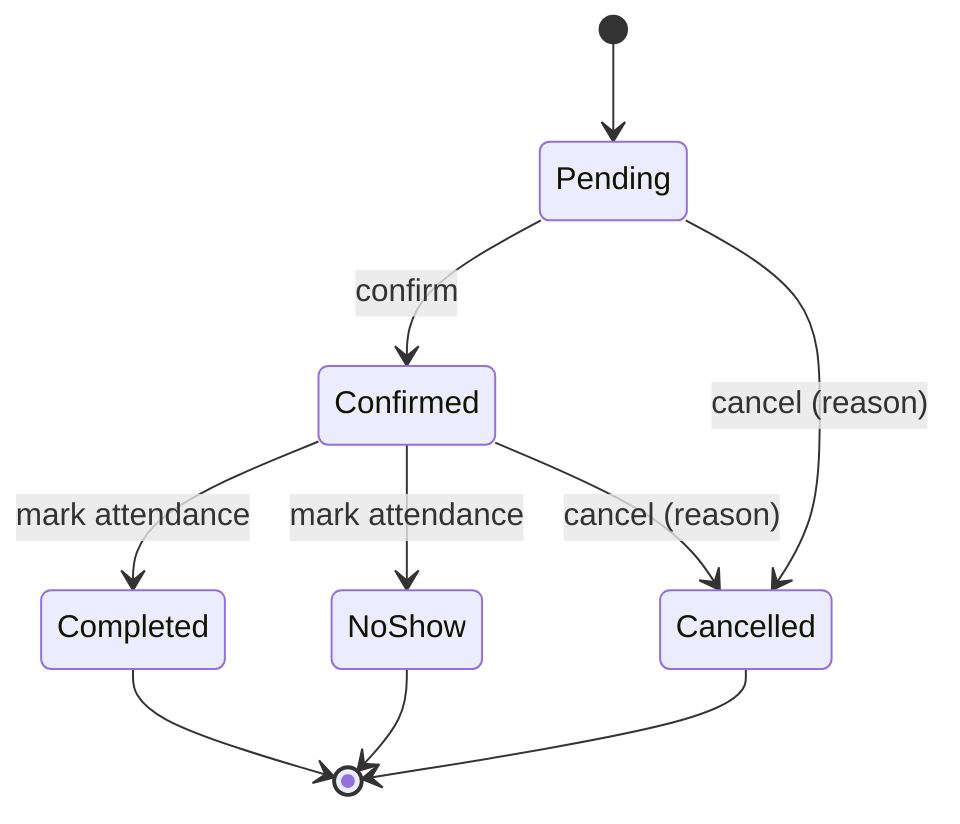

## State Machine: Consent

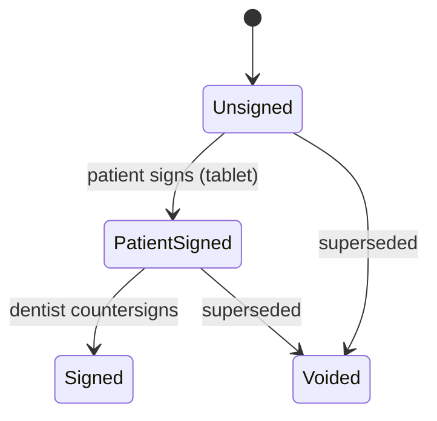

## Module Dependency

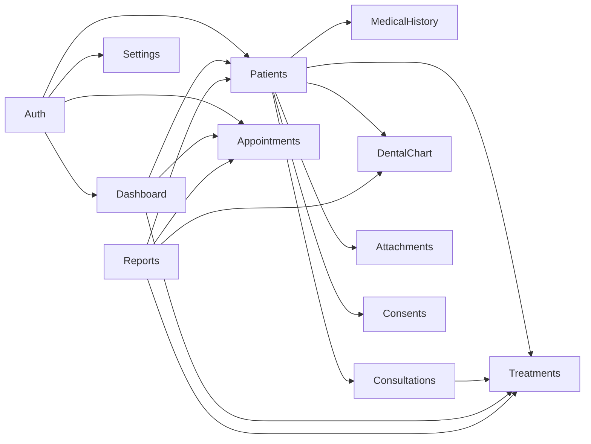

## Permission Hierarchy

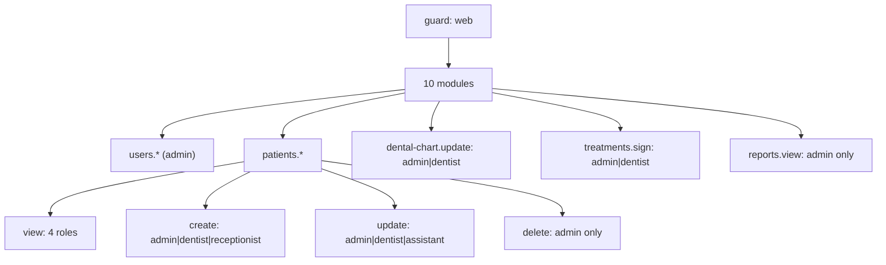

---

# 17 — Process Flows

All flows as code skeletons. Wizard flow is the core tablet experience (spec tail section).

## Flow 1 — Patient Intake Wizard (tablet, spec-ordered)

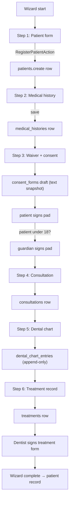

```php
// routes/web.php
Route::prefix('wizard')->group(function () {
    Route::get('/{patient?}', [WizardController::class, 'index'])->name('wizard.index');
    Route::post('/patients', [WizardController::class, 'patient'])->name('wizard.patient');       // step 1
    Route::post('/medical-histories', [WizardController::class, 'medicalHistory']);               // step 2
    Route::post('/consents', [WizardController::class, 'consent']);                                // step 3
    Route::post('/consultations', [WizardController::class, 'consultation']);                     // step 4
    Route::post('/dental-chart', [WizardController::class, 'dentalChart']);                       // step 5
    Route::post('/treatments', [WizardController::class, 'treatment']);                           // step 6
});
```

Each step POSTs its own entity and returns `{ next_step, entity_id }` — steps are **independently persisted**, so a tablet crash loses at most the current step; resume re-enters at the last completed step (Pinia stores `wizard.progress`).

## Flow 2 — Appointment Lifecycle

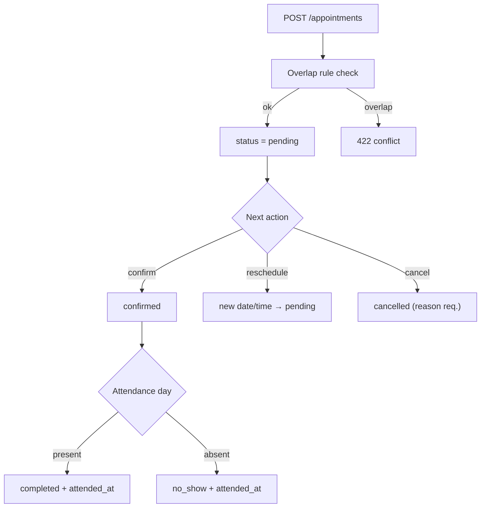

```php
final class AppointmentService
{
    public function create(array $data, User $actor): Appointment
    {
        abort_unless($actor->can('appointments.create'), 403);
        $this->ensureNoOverlap($data);                       // 422 on conflict
        return $this->transition($appointment = Appointment::create($data), 'created', $actor);
    }

    private function transition(Appointment $a, string $event, User $actor): Appointment
    {
        throw_unless(in_array($event, self::TRANSITIONS[$a->status->value], true),
            InvalidTransitionException::class);              // 422
        $a->update([...]);                                   // status, attended_at...
        activity()->performedOn($a)->causedBy($actor)->log("appointment.{$event}");
        return $a;
    }
}
```

## Flow 3 — Consent Signing (legal, spec §12)

```php
final class ConsentService
{
    public function signPatient(ConsentForm $form, string $svg, ?string $guardianName, ?string $guardianSvg): ConsentForm
    {
        abort_unless(request()->user()->can('consents.sign-patient'), 403);
        abort_unless($form->status === ConsentStatus::Unsigned, 409);
        if ($form->patient->age < 18) {                       // Q4
            abort_unless($guardianName && $guardianSvg, 422, 'Guardian signature required for minors.');
        }
        // 1. validate+store SVG(s) → SignatureStorageService
        // 2. stamp patient_signed_at, capture ip_address + user_agent
        // 3. status = patient_signed, activity()->log('consent.patient_signed')
        return $form->refresh();
    }
}
```

## Flow 4 — Dental Chart Update

```php
final class RecordToothConditionAction
{
    public function handle(Patient $p, int $tooth, DentitionType $dentition, ToothCondition $condition,
                           ?ToothSurface $surface, Carbon $recordedAt, User $dentist): DentalChartEntry
    {
        abort_unless($dentist->can('dental-chart.update'), 403);
        abort_unless($this->validFdiRange($tooth, $dentition), 422, "Tooth {$tooth} invalid for {$dentition->value} dentition.");
        $entry = DentalChartEntry::create([...]);             // immutable insert
        activity()->performedOn($entry)->causedBy($dentist)->log('chart.updated');
        return $entry;                                        // response includes new currentState projection
    }
}
```

## Flow 5 — Report Generation (admin, monthly statistics)

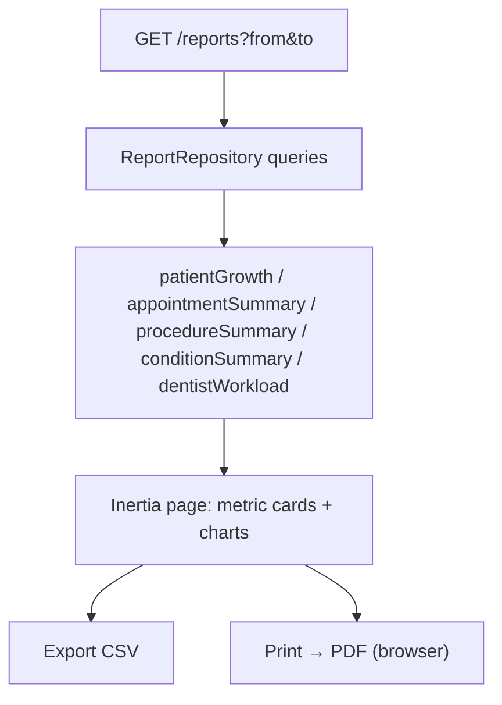

## Flow 6 — User Management (admin)

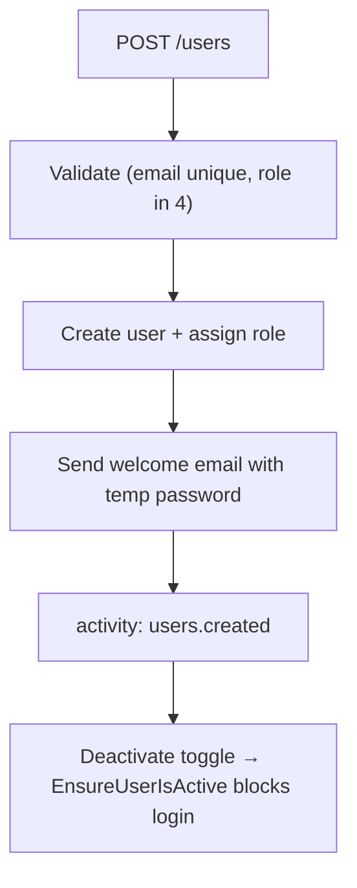

```php
final class CreateUserAction
{
    public function handle(array $data, User $actor): User
    {
        abort_unless($actor->can('users.create'), 403);
        return DB::transaction(function () use ($data) {
            $user = User::create(['password' => Str::password(10), ...$data]);
            $user->assignRole($data['role']);
            Mail::to($user)->queue(new WelcomeMail($user, $temporaryPassword));
            activity()->performedOn($user)->causedBy($actor)->log('users.created');
            return $user;
        });
    }
}
```

---

# 18 — Open Questions, Assumptions & Risks

Every assumption is explicit. Defaults marked **(DEFAULT)** — implement unless client answers otherwise.

## Open Questions

### Q1 — Tooth numbering system
Spec §9 does not name a numbering system. FDI (ISO 3950) assumed: adult 11–48, primary 51–85. **(DEFAULT: FDI)** — some PH clinics use Universal (1–32) or Palmer. Validated against the clinic's actual PDA chart.

### Q2 — `sex` field values
Spec says "Sex" with no options. **(DEFAULT: male/female)**. PHP Registry of Birth uses male/female; add "Other" if the clinic wants it.

### Q3 — Patient number format
Spec: "Patient number" field only. **(DEFAULT: `YYYY-NNNN` e.g. `2026-0001`, per-year sequence, stored in `patients.patient_number`)**. Alternative: 6-digit running number with year prefix (e.g., `260001`). Must be decided before Phase 1.

### Q4 — Minor consent / guardian handling
Spec's signature section includes "Parent/guardian" line but no age rule. **(DEFAULT: guardian required when patient age < 18 at signing; guardian name + signature stored)**. Confirm PH legal age (18) matches clinic policy.

### Q5 — Medical history: fixed columns vs dynamic question bank
Spec lists 10 fixed questions. **(DEFAULT: fixed columns per spec — simplest wizard)**. If the clinic edits question sets over time, a `questions` + `history_answers` pair is the fallback design (breaking change flagged).

### Q6 — Password policy
**(DEFAULT: Breeze default, min 8 chars)**. Clinic staff on tablets may want simpler; keep default for security, note it in training.

### Q7 — Appointment dentist assignment & overlap rule
Spec doesn't state single-dentist scheduling. **(DEFAULT: optional `dentist_id`; overlap forbidden when set)**. If multiple dentists share the tablet calendar, revisit the rule.

### Q8 — Billing / fees
Spec §10 has no fee field and no payments module. **(DEFAULT: out of scope v1)** — confirmed so the schema doesn't need a fee column. If the clinic bills later, a `billing` module would add `fees` + `payments` tables.

### Q9 — Attachment size limits
Spec lists accepted types only. **(DEFAULT: images 10 MB, PDFs/X-rays 25 MB, total per patient unlimited)**. Confirmed against clinic X-ray file sizes (PANO DICOM exports can exceed 25 MB — see Q18).

### Q10 — Visual design
No Figma exists. All colors/UI in 02-tech-stack are **improvised tokens**. **(DEFAULT: dental-teal palette + condition color map as proposed)**. Flag: replace with real Figma tokens when design is produced; all tokens centralized in `@theme` so swap is cheap.

### Q11 — Follow-up appointments widget
Spec §4 lists "Follow-up appointments" but §7 has no follow-up flag. **(DEFAULT: `is_follow_up` boolean on `appointments`, default false)**. Alternatively infer from `reason` text ("follow-up") — fragile; boolean preferred.

### Q12 — PDF export library
Reports print via browser print in v1. **(DEFAULT: browser print)**. DomPDF/laravel-snappy as upgrade path for server-side PDFs (consent forms might need server PDFs for archival — revisit at Phase 3).

### Q13 — Charting library for reports
**(DEFAULT: chart.js + vue-chartjs)** — battle-tested, small bundle. Alternatives: lightweight SVG hand-rolled (no dep) if bundle size matters on tablets.

### Q14 — Storage: local vs S3
**(DEFAULT: local disk in v1; `s3` disk config ready)**. Production deployment decides; uploads/signatures sit behind the backup pipeline either way.

### Q15 — Archival retention
Phase 4: **(DEFAULT: patients inactive 5 years → archive + soft delete; backup retention 30 daily / 12 monthly / 3 yearly)**. Clinico-legal requirement: PH records retention law (RA 10173 / professional practice) — confirm exact retention years with clinic.

### Q16 — Shared tablets / multi-session
Assumption: each staff member logs in on their own device. **(DEFAULT: one session per user, long-lived)**. If tablets are shared with one generic account, sessions collide — revisit `is_active`/single-session policy.

### Q17 — Offline mode
Clinic Wi-Fi assumed reliable. **(DEFAULT: online-only v1)**. Offline-first (service worker + local queue) is a significant v2 feature — confirm during Phase 1 deployment at the clinic.

### Q18 — X-ray handling
X-rays are images (JPEG/PNG) in spec §11. True DICOM/PANO viewers are **out of scope**. **(DEFAULT: image upload + full-screen zoom viewer)**. Confirm the clinic's X-ray equipment exports standard image formats.

## Assumptions & Risks

| # | Assumption | Risk if wrong | Mitigation |
|---|---|---|---|
| A1 | Single clinic, single tenant | Multi-branch expansion requires `branch_id` migration across 12 tables | Keep tenancy decision at top of overview; schema has no tenant leaks |
| A2 | Patients never log in | Clinic wants patient portal (view records online) | Out of scope; consent forms state collection purpose — covered |
| A3 | Append-only chart is acceptable UX (corrections create new entries) | Dentist expects to erase mistakes silently | Audit trail is the point of the system; training + history view |
| A4 | Wizard steps persist independently | Partial intake data when flow abandoned | Status-free draft rows acceptable; "incomplete intake" list on dashboard (nice-to-have) |
| A5 | Tablet browsers: Chrome/Safari/Edge only | An Android WebView or older browser is used | Feature-test SVG signature + `pointer events` at login (browser check screen) |
| A6 | Electronic signature is legally sufficient | Clinic lawyer requires biometric/notarized consent | SVG + ip/user_agent + timestamp snapshot is the documented defense; signature metadata kept immutable |
| A7 | PHP 8.3 + MySQL 8 available at hosting | Shared hosting with MySQL 5.7 | Migrations avoid newer MySQL features; require 8.0+ in composer platform check |

## Validation Questions for the Client

1. Which tooth numbering does the physical PDA chart use? (Q1)
2. Exact patient number scheme desired? (Q3)
3. Fee/payment fields needed anywhere? (Q8)
4. Average X-ray file size? (Q9, Q18)
5. Does the clinic require a patient portal or only staff access? (A2)
6. Records retention period per PH law/practice? (Q15)
7. Will tablets be shared or per-user? (Q16)

## Sample API Workflow (end-to-end intake)

```
POST /wizard/patients            → { patient_id: 41 }
POST /wizard/medical-histories   → { history_id: 12 }
POST /consents                   → { consent_id: 7, status: "unsigned" }
POST /consents/7/patient-sign    → { status: "patient_signed" }      (SVG payload)
POST /wizard/consultations       → { consultation_id: 9 }
POST /dental-chart/entries       → { entry_id: 88 }                   (tooth 26, caries, occlusal)
POST /wizard/treatments          → { treatment_id: 3 }
POST /treatments/3/sign          → { signed_at: "2026-08-01T10:12:33Z", path: "signatures/..." }
```
